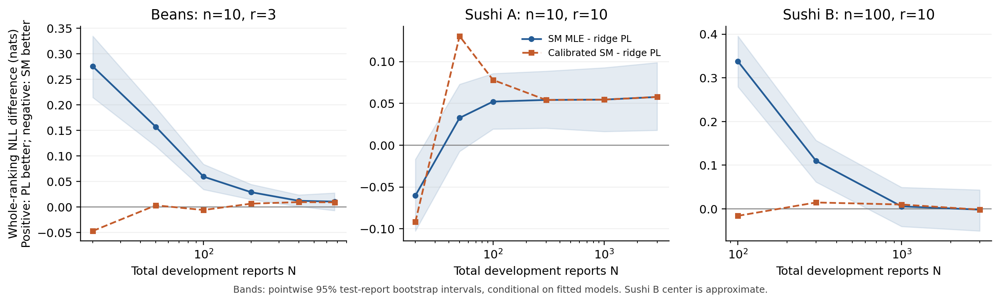

# Selective Mallows vs. Plackett–Luce

Reproducible Python experiments comparing **direct subset Mallows** (SM) and
**Plackett–Luce** (PL) on complete rankings of displayed subsets. The repository
contains the implemented estimators, data access and validation, saved fitted
parameters, aggregate results, figures, and an analysis.

**Main finding:** neither model wins across all tasks. Exact SM fitting removes
an optimization confound at small item counts. Prediction also depends on
dispersion estimation and the probability structure within a ranking.

## Start here

- **[New: original wheat and SP-Rank context follow-up](docs/context_followup.md)** — 493 intact wheat reports; context effect remains unresolved; all six SP-Rank tasks lack the targeted objective-gap contrast.

- **[Strict feature-transition study: completed analysis](docs/strict_feature_analysis.md)**
- [Strict-study results, source audit and reproduction](results/strict_features/README.md)

- **[Exposure regimes, manuscript estimators and ATP tennis](docs/exposure_analysis.md)**
- [New results and reproduction commands](results/exposure/README.md)

- [Analysis and conclusions](docs/analysis.md)
- [Mechanism diagnostics and formal definitions](docs/diagnostics.md)
- [Algorithms, sources, and exactness guarantees](docs/algorithms.md)
- [Dataset properties, preprocessing, and licenses](data/README.md)
- [Reproduction and uncertainty conventions](docs/reproducibility.md)
- [References](docs/references.md) and [BibTeX](docs/references.bib)

## Strict feature study (25 September 2026)

Completed **4,760 independent synthetic training datasets** and **16 new real
tasks (8,763 original reports)**. Protocols were frozen before their respective
fits; the diagnostic-budget follow-up is explicitly exploratory.

Changing probabilities within the same Kendall-distance shell reverses the
predictive winner even when every shell mass remains fixed. Puzzle 2 provides
a tentative SM-favorable example; two 2024 partial-dots tasks favor PL.
The specific real-data SM context effect remains unconfirmed.

Strict fits use exact/certified SM centers, uncapped dispersion, the literal
sharp/efficient estimators in their computational domains, and Hunter MM for PL.
No penalty, probability floor, report repair, item deletion or heuristic MLE
replacement is used. Larger sharp sieves are unavailable; all executed Section 3
fits have depth zero. All nine additional agricultural candidates failed the
frozen whole-task eligibility rule; every exclusion is documented.


See the [English report](docs/strict_feature_analysis.md) and
[reproduction commands](results/strict_features/README.md#reproduce).
After a workspace disconnect during publication, the same experiments were
successfully replayed in GitHub Actions. All recorded real-task deltas, primary
simulation summaries and diagnostic-budget accuracies matched. See the
[run status](results/strict_features/recovery_status.json) and
[validation](results/strict_features/validation.json). The replay adds no
independent experimental evidence.

Earlier results below are separate historical experiments with their original
regularization and heuristic choices.

## Historical base experiments

- Three real-data tasks: Beans, Sushi A, and Sushi B; **72 primary paired fits**.
- Three generating mechanisms × four sample sizes × 30 independent repeats:
  **360 synthetic paired fits**.
- Center-optimization benchmarks, small-sample dispersion shrinkage, same-order
  comparisons, season transfer, and split sensitivity.
- Held-out diagnostics for pair reliability, probability allocation within
  Kendall-distance shells, and changes in pair probabilities across displayed sets.

The main score is **held-out whole-ranking conditional NLL**, in natural-log
units. Define Δ = NLL(SM) − NLL(PL); positive values favor PL.
Joint likelihood is not included.

| Dataset | Training reports N | SM NLL | PL NLL | Δ [95% CI] |
|---|---:|---:|---:|---:|
| Beans | 673 | 1.7925 | 1.7818 | 0.0107 [−0.0068, 0.0277] |
| Sushi A | 3,000 | 14.3078 | 14.2501 | 0.0577 [0.0179, 0.0988] |
| Sushi B, approximate SM | 3,000 | 14.2641 | 14.2658 | −0.0018 [−0.0506, 0.0435] |

These are pointwise, exploratory intervals from paired **whole-report**
bootstrap, conditional on the fitted models. They do not include training-sample
uncertainty. NLL magnitudes should not be compared across different report lengths.



## Historical models and fitting

SM generates a ranking **directly on the displayed set**, around the restriction
of one global center. It does not generate a full ranking and then delete items.

| Component | Implementation |
|---|---|
| SM center, n = 10 | Exact subset dynamic programming; global Kemeny optimum |
| SM center, n = 100 | Eight-start insertion search plus a time-limited MILP bound audit; approximate |
| SM dispersion | Profile conditional likelihood over β ∈ [0, 10] |
| PL worths | Full listwise likelihood with validation-selected ridge penalty |
| Small-sample sensitivity | Validation-selected multiplicative shrinkage of SM β |

Beans, Sushi A, and all main simulations have n = 10. Sushi B has n = 100;
its centers have **no global optimality certificate**. The exposure extension now implements the exact sharp sieve for blocks up to
eight items, plus the proof-constant Section 3 estimator. Larger exact sieves
are explicitly unavailable; all executed Section 3 fits have depth zero. These experiments do not establish minimax optimality of the MLE.

## Historical pipeline reproduction

Run commands from the repository root. Python **3.12** is recommended.
`requirements-lock.txt` records the versions used for the saved experiments.

```bash
python -m venv .venv
source .venv/bin/activate
python -m pip install -r requirements-lock.txt
python -m pytest -q
```

Replot the saved primary results without downloading data:

```bash
python make_figures.py
```

Download/verify the inputs, then reproduce the diagnostics using the saved fits:

```bash
python download_data.py
python download_data.py --verify-only
python run_diagnostics.py --same-center
```

Run the complete experiment pipeline:

```bash
python run_experiments.py --part all --synthetic-reps 30
python run_followups.py --cutting-plane
python run_diagnostics.py --same-center
python make_figures.py
```

Commands regenerate files in `results/` and `figures/`. Use a separate checkout
if you want to preserve an untouched copy of the recorded run. The two optional
cutting-plane audits each have a 60-second limit. Time-limited large-instance
optimization can produce different bounds on a different machine.
See [reproducibility notes](docs/reproducibility.md) for selective runs and checks.

## Repository layout

| Path | Contents |
|---|---|
| `src/strict_models.py`, `src/strict_features.py` | Strict published-estimator fits and controlled feature interventions |
| `run_strict_*.py`, `validate_strict_features.py` | Strict experiments, follow-ups and replay validation |
| `download_strict_*.py`, `make_strict_figures.py` | Pinned sources, eligibility audit and strict-study figures |
| `src/models.py` | Likelihoods, center solvers, dispersion/PL fits, direct-subset samplers |
| `src/cutting_plane.py` | Additional Kemeny lower/upper-bound solver |
| `src/data.py` | Verified data acquisition, strict ranking parsing, exposure audits |
| `src/diagnostics.py` | Exact shell probabilities, pair marginals, report-bootstrap diagnostics |
| `run_experiments.py` | Main real and synthetic comparisons |
| `run_followups.py` | Exploratory same-order, temporal, split, and solver checks |
| `run_diagnostics.py` | Exploratory explanations of model differences |
| `download_data.py`, `make_figures.py` | Input verification and figure regeneration |
| `data/` | Bundled Beans data, source manifest, download policy, third-party license |
| `results/` | Aggregate CSV/JSON results, fitted parameters, provenance, validation |
| `figures/` | Research figures in PNG and editable SVG |
| `docs/` | English analysis, algorithms, references, and preserved protocols |
| `tests/` | Exhaustive small-instance and probability/gradient correctness checks |

## Data and scope

The unchanged Beans file is bundled with its upstream GPL-3 notice. **Sushi
source data are not redistributed**, in accordance with the creator's terms;
the downloader retrieves the original archive and verifies its SHA256 hash.
Raw Sushi files, processed respondent-level data, and private loss caches are
excluded from Git. No unpublished manuscript is included.

Beans and Sushi have no known true central ranking. Sushi A and B share
respondents and use aligned splits; they are not independent participant
samples. Beans has no assessor identifier. Real subset designs are not assumed
uniform; the synthetic design is uniform and independent. See
[limitations and next experiments](docs/analysis.md#limitations-and-next-experiments).

Research and data sources are credited in [References](docs/references.md).
Third-party data retain their own terms; see [THIRD_PARTY_NOTICES.md](THIRD_PARTY_NOTICES.md).
No project-wide open-source license has been assigned to the original research code.

## Exposure extension

The new Python files are src/manuscript_estimators.py, src/tennis.py,
run_exposure.py, run_exposure_followup.py, make_exposure_figures.py and
validate_exposure.py. They add the manuscript estimators, actual lambda/mu
coverage audits, uniform-design simulations, and chronological ATP seasons.
The report separates center recovery, prediction, and regularization effects.

~~~bash
OPENBLAS_NUM_THREADS=1 OMP_NUM_THREADS=1 python run_exposure.py --part all
OPENBLAS_NUM_THREADS=1 OMP_NUM_THREADS=1 python run_exposure_followup.py
python make_exposure_figures.py
python validate_exposure.py
~~~

The extension was regenerated successfully in GitHub Actions after a workspace
disconnect. results/exposure/validation.json records 58 replayed designs, all
60 real fits, ten seasons and matching pre-interruption results. The workflow
is now manual: Actions → Recover exposure experiments → Run workflow.
ATP raw data are downloaded separately from an immutable archive of Jeff
Sackmann's CC BY-NC-SA 4.0 data. Raw Sushi observations remain excluded.
