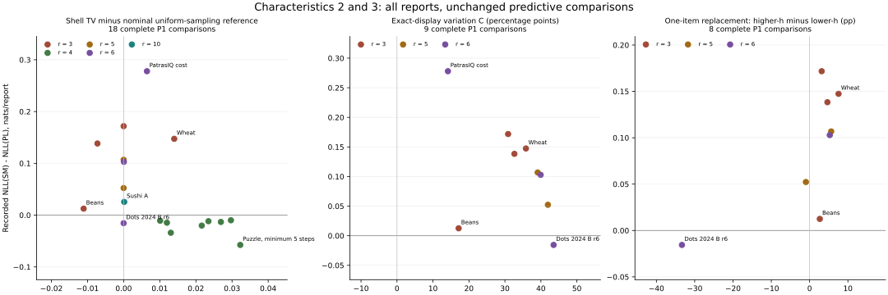

<!-- Generated by make_feature_summary.py from saved feature tables; no refitting. -->
# All three data characteristics beside prediction gaps

[Definitions and formulas](README.md) · [All features in one CSV](all_features.csv) · [Detailed pair counts](pairs/) · [Shell summaries](structure/shells/) · [Context summaries](structure/pairs/)

Every feature uses the entire eligible task and the same full-data reference order. Δ = NLL(SM) − NLL(PL) is copied from the existing predictive comparison; positive favors PL. No new prediction experiment, split, confidence interval or significance test is introduced.

| Characteristic | Overview columns | Reading the value |
|---|---|---|
| 1. Different pairs at equal h | H, percentage points | Observed cross-pair dispersion, compared within each exact displayed-center gap before aggregation |
| 2. Same display and Kendall shell | TV / uniform reference | Empirical nonuniformity / its nominal iid-uniform sampling scale at the actual shell counts; the reference is not a calibrated test |
| 3. Same pair across displays | C and R, percentage points | C: unsigned variation across exact displays. R: higher-h minus lower-h rate when exactly one other item is replaced |

Read these values with the support tables below: one-observation cells can generate large H, TV or C. NA denotes an undefined contrast or incomplete predictive comparison, not verified equality.

## All three characteristics by dataset

### P1 tasks

All 23 tasks have certified full-data reference centers. The existing NLL means use 30 confirmation partitions; four incomplete paired means remain NA. Finite-only conditional means are listed separately in the detail table.

| Task | r | 1: H, pp | 2: TV / uniform reference | 3: C, pp | 3: R, pp | Existing Δ | Finite partitions |
|---|---:|---:|---:|---:|---:|---:|---:|
| Beans | 3 | 6.61 | 0.23473 / 0.24580 | 17.14 | +2.66 | +0.01251 | 30/30 |
| Sushi A | 10 | 7.36 | 0.99351 / 0.99335 | NA | NA | +0.02555 | 30/30 |
| Sushi B | 10 | 14.20 | 0.99978 / 0.99978 | 45.58 | NA | NA | 8/30 |
| Dots 2013, gap 3 | 4 | 1.96 | 0.08803 / 0.06112 | NA | NA | -0.01319 | 30/30 |
| Dots 2013, gap 5 | 4 | 1.00 | 0.07310 / 0.06112 | NA | NA | -0.01466 | 30/30 |
| Dots 2013, gap 7 | 4 | 1.45 | 0.08374 / 0.06027 | NA | NA | -0.01172 | 30/30 |
| Dots 2013, gap 9 | 4 | 1.02 | 0.07519 / 0.06213 | NA | NA | -0.03407 | 30/30 |
| Puzzle, minimum 11 steps | 4 | 2.97 | 0.07214 / 0.06204 | NA | NA | -0.01077 | 30/30 |
| Puzzle, minimum 5 steps | 4 | 2.63 | 0.09677 / 0.06450 | NA | NA | -0.05756 | 30/30 |
| Puzzle, minimum 7 steps | 4 | 1.92 | 0.08276 / 0.06114 | NA | NA | -0.02021 | 30/30 |
| Puzzle, minimum 9 steps | 4 | 3.34 | 0.09144 / 0.06175 | NA | NA | -0.00996 | 30/30 |
| Dots 2024 A r2 | 2 | 27.34 | NA | NA | NA | NA | 14/30 |
| Dots 2024 A r3 | 3 | 27.17 | 0.50000 / 0.50000 | 30.89 | +3.15 | +0.17177 | 30/30 |
| Dots 2024 A r5 | 5 | 23.56 | 0.86988 / 0.86988 | 39.10 | +5.63 | +0.10684 | 30/30 |
| Dots 2024 A r6 | 6 | 21.74 | 0.93426 / 0.93419 | 39.93 | +5.26 | +0.10285 | 30/30 |
| Dots 2024 B r2 | 2 | 33.46 | NA | NA | NA | NA | 23/30 |
| Dots 2024 B r3 | 3 | 32.88 | 0.48551 / 0.49275 | 32.64 | +4.65 | +0.13834 | 30/30 |
| Dots 2024 B r5 | 5 | 25.34 | 0.88176 / 0.88176 | 41.94 | -0.97 | +0.05227 | 30/30 |
| Dots 2024 B r6 | 6 | 23.36 | 0.94862 / 0.94862 | 43.53 | -33.33 | -0.01556 | 30/30 |
| Wheat | 3 | 19.15 | 0.48400 / 0.47000 | 35.84 | +7.56 | +0.14741 | 30/30 |
| Sounds | 2 | 9.37 | NA | NA | NA | +0.00797 | 30/30 |
| PatrasIQ cost | 6 | 16.45 | 0.88619 / 0.87974 | 14.16 | NA | +0.27794 | 30/30 |
| PatrasIQ population | 6 | 18.35 | 0.91983 / 0.91759 | 14.34 | NA | NA | 29/30 |

### ATP annual tasks

These ten tasks have r=2, so characteristics 2 and 3 have no nontrivial contrast. Their approximate-center, full-year features and regularized T1 seen-player July–December prediction target are kept separate from P1. Each NLL gap is one seasonal comparison.

| Task | r | 1: H, pp | 2: TV / uniform reference | 3: C, pp | 3: R, pp | Existing Δ | Seasonal comparisons |
|---|---:|---:|---:|---:|---:|---:|---:|
| ATP 2010 | 2 | 36.22 | NA | NA | NA | +0.00347 | 1/1 |
| ATP 2011 | 2 | 35.41 | NA | NA | NA | +0.02657 | 1/1 |
| ATP 2012 | 2 | 34.56 | NA | NA | NA | +0.03568 | 1/1 |
| ATP 2013 | 2 | 35.68 | NA | NA | NA | +0.04438 | 1/1 |
| ATP 2014 | 2 | 36.05 | NA | NA | NA | +0.01526 | 1/1 |
| ATP 2015 | 2 | 35.34 | NA | NA | NA | +0.04083 | 1/1 |
| ATP 2016 | 2 | 35.83 | NA | NA | NA | +0.02976 | 1/1 |
| ATP 2017 | 2 | 37.18 | NA | NA | NA | +0.01181 | 1/1 |
| ATP 2018 | 2 | 37.34 | NA | NA | NA | +0.01439 | 1/1 |
| ATP 2019 | 2 | 37.70 | NA | NA | NA | +0.02331 | 1/1 |

## Reading the three characteristics together

- Sushi A has H=7.36 points, but its shell TV .99351 is close to the nominal sampling reference .99335; its fixed display makes characteristic 3 unavailable. Its existing Δ=+.02555 favors PL.
- Beans has shell TV .23473 versus reference .24580 and R=+2.66 points with repeated observations in both displays of all 420 matched contrasts. Its Δ=+.01251 favors PL despite the positive h association.
- Dots 2013 and Puzzle combine relatively small H with complete NLL gaps favoring SM. Their coded displays are fixed, so they cannot establish a same-pair display effect. Nonzero shell-frequency departures do not by themselves establish that PL predicts better.
- Wheat and dots2024 need particular care about sparse cells. Wheat has R=+7.56 points, but only 70 of 2,022 contrasts have both displays observed at least twice. For dots2024 B r=6, R is negative while the broader within-pair slope is positive; these use different contrasts and do not contradict one another.

The three characteristics describe different constraints. They are not votes to tally for a model winner. Reference-center estimation, observation counts, assessor/display mixtures and ranking length affect interpretation; the existing whole-ranking NLL remains the predictive comparison.

## 1. Equal-gap pair frequencies

H and H1 are percentage points. H1 restricts the comparison to adjacent pairs. Median count is per observed pair × h cell. The ≥5 field describes support and does not filter the feature calculation.

The reference centers for all 23 tasks are certified full-data Kendall-objective minima. Original prediction fits and test losses are unchanged. Four incomplete means remain unavailable; conditional means use only the listed successful repetitions.

| Task / exact pair counts | H | H1 | Median count | Occurrences in cells with ≥5 reports | Δ | Finite repetitions | Conditional Δ if incomplete |
|---|---:|---:|---:|---:|---:|---:|---:|
| [Beans](pairs/beans.csv) | 6.61 | 5.34 | 31 | 99.9% | +0.01251 | 30/30 | — |
| [Sushi A](pairs/sushi_a.csv) | 7.36 | 8.07 | 5000 | 100.0% | +0.02555 | 30/30 | — |
| [Sushi B](pairs/sushi_b.csv) | 14.20 | 12.30 | 4 | 90.9% | Unavailable | 8/30 | +0.01086 |
| [Dots 2013, gap 3](pairs/00024-00000001.csv) | 1.96 | 2.26 | 795 | 100.0% | -0.01319 | 30/30 | — |
| [Dots 2013, gap 5](pairs/00024-00000002.csv) | 1.00 | 0.62 | 794 | 100.0% | -0.01466 | 30/30 | — |
| [Dots 2013, gap 7](pairs/00024-00000003.csv) | 1.45 | 1.57 | 800 | 100.0% | -0.01172 | 30/30 | — |
| [Dots 2013, gap 9](pairs/00024-00000004.csv) | 1.02 | 1.31 | 794 | 100.0% | -0.03407 | 30/30 | — |
| [Puzzle, minimum 11 steps](pairs/00025-00000001.csv) | 2.97 | 3.09 | 793 | 100.0% | -0.01077 | 30/30 | — |
| [Puzzle, minimum 5 steps](pairs/00025-00000002.csv) | 2.63 | 3.29 | 795 | 100.0% | -0.05756 | 30/30 | — |
| [Puzzle, minimum 7 steps](pairs/00025-00000003.csv) | 1.92 | 2.28 | 795 | 100.0% | -0.02021 | 30/30 | — |
| [Puzzle, minimum 9 steps](pairs/00025-00000004.csv) | 3.34 | 3.67 | 797 | 100.0% | -0.00996 | 30/30 | — |
| [Dots 2024 A r2](pairs/dots2024_A_r2.csv) | 27.34 | 27.34 | 1 | 0.0% | Unavailable | 14/30 | +0.20081 |
| [Dots 2024 A r3](pairs/dots2024_A_r3.csv) | 27.17 | 26.80 | 2 | 4.6% | +0.17177 | 30/30 | — |
| [Dots 2024 A r5](pairs/dots2024_A_r5.csv) | 23.56 | 21.32 | 2 | 42.7% | +0.10684 | 30/30 | — |
| [Dots 2024 A r6](pairs/dots2024_A_r6.csv) | 21.74 | 20.39 | 3 | 55.2% | +0.10285 | 30/30 | — |
| [Dots 2024 B r2](pairs/dots2024_B_r2.csv) | 33.46 | 33.46 | 1 | 0.0% | Unavailable | 23/30 | +0.10420 |
| [Dots 2024 B r3](pairs/dots2024_B_r3.csv) | 32.88 | 31.66 | 1 | 5.2% | +0.13834 | 30/30 | — |
| [Dots 2024 B r5](pairs/dots2024_B_r5.csv) | 25.34 | 24.64 | 2 | 43.6% | +0.05227 | 30/30 | — |
| [Dots 2024 B r6](pairs/dots2024_B_r6.csv) | 23.36 | 20.54 | 3 | 51.4% | -0.01556 | 30/30 | — |
| [Wheat](pairs/wheat.csv) | 19.15 | 19.62 | 7 | 87.4% | +0.14741 | 30/30 | — |
| [Sounds](pairs/sounds.csv) | 9.37 | 9.37 | 21 | 100.0% | +0.00797 | 30/30 | — |
| [PatrasIQ cost](pairs/patras_cost.csv) | 16.45 | 17.95 | 5 | 96.1% | +0.27794 | 30/30 | — |
| [PatrasIQ population](pairs/patras_population.csv) | 18.35 | 19.77 | 5 | 93.1% | Unavailable | 29/30 | +0.07527 |

### ATP pair-frequency support

Each feature uses all completed, prior-catalogue-eligible matches in that year, including both halves and test matches whose players were unseen in training. Centers are approximate. Δ uses the existing T1 main seen-player July–December target: bounded/shrunk efficient-center SM versus ridge PL. Thus the feature population is broader than this prediction target; these values are not pooled with P1.

| Task / exact pair counts | H | H1 | Median count | Occurrences in cells with ≥5 reports | Δ | Seasonal comparisons | Conditional Δ |
|---|---:|---:|---:|---:|---:|---:|---:|
| [ATP 2010](pairs/atp_2010.csv) | 36.22 | 36.22 | 1 | 0.4% | +0.00347 | 1/1 | — |
| [ATP 2011](pairs/atp_2011.csv) | 35.41 | 35.41 | 1 | 1.1% | +0.02657 | 1/1 | — |
| [ATP 2012](pairs/atp_2012.csv) | 34.56 | 34.56 | 1 | 1.4% | +0.03568 | 1/1 | — |
| [ATP 2013](pairs/atp_2013.csv) | 35.68 | 35.68 | 1 | 1.1% | +0.04438 | 1/1 | — |
| [ATP 2014](pairs/atp_2014.csv) | 36.05 | 36.05 | 1 | 0.6% | +0.01526 | 1/1 | — |
| [ATP 2015](pairs/atp_2015.csv) | 35.34 | 35.34 | 1 | 0.8% | +0.04083 | 1/1 | — |
| [ATP 2016](pairs/atp_2016.csv) | 35.83 | 35.83 | 1 | 0.7% | +0.02976 | 1/1 | — |
| [ATP 2017](pairs/atp_2017.csv) | 37.18 | 37.18 | 1 | 0.2% | +0.01181 | 1/1 | — |
| [ATP 2018](pairs/atp_2018.csv) | 37.34 | 37.34 | 1 | 0.2% | +0.01439 | 1/1 | — |
| [ATP 2019](pairs/atp_2019.csv) | 37.70 | 37.70 | 1 | 0.2% | +0.02331 | 1/1 | — |

## 2. Same display, same Kendall-distance shell

TV compares the actual conditional ranking frequencies with a uniform distribution over **all** permutations in that shell, including zero-count permutations. Values are averaged over occupied nontrivial shells, weighted by their observation counts. “Uniform sampling reference” is the exact expected empirical TV at the same shell sizes/counts under iid uniform draws and a fixed reference; it is not a fitted SM prediction, calibrated test, or bias-corrected population estimate.

| Task / shell summaries | TV | Uniform sampling reference | Difference | Median observations per shell | Median m/a | Observations in repeated shells | Existing Δ |
|---|---:|---:|---:|---:|---:|---:|---:|
| [Beans](structure/shells/beans.csv) | 0.235 | 0.246 | -0.011 | 2.0 | 1 | 92.1% | +0.01251 |
| [Sushi A](structure/shells/sushi_a.csv) | 0.994 | 0.993 | +0.000 | 74.0 | 0.000852 | 99.9% | +0.02555 |
| [Sushi B](structure/shells/sushi_b.csv) | 1.000 | 1.000 | +0.000 | 1.0 | 1.16e-05 | 0.0% | NA |
| [Dots 2013, gap 3](structure/shells/00024-00000001.csv) | 0.088 | 0.061 | +0.027 | 143.0 | 27 | 100.0% | -0.01319 |
| [Dots 2013, gap 5](structure/shells/00024-00000002.csv) | 0.073 | 0.061 | +0.012 | 158.0 | 26.3 | 100.0% | -0.01466 |
| [Dots 2013, gap 7](structure/shells/00024-00000003.csv) | 0.084 | 0.060 | +0.023 | 129.0 | 21.5 | 100.0% | -0.01172 |
| [Dots 2013, gap 9](structure/shells/00024-00000004.csv) | 0.075 | 0.062 | +0.013 | 123.0 | 20.5 | 100.0% | -0.03407 |
| [Puzzle, minimum 11 steps](structure/shells/00025-00000001.csv) | 0.072 | 0.062 | +0.010 | 157.0 | 30.7 | 100.0% | -0.01077 |
| [Puzzle, minimum 5 steps](structure/shells/00025-00000002.csv) | 0.097 | 0.065 | +0.032 | 116.0 | 19.3 | 100.0% | -0.05756 |
| [Puzzle, minimum 7 steps](structure/shells/00025-00000003.csv) | 0.083 | 0.061 | +0.022 | 127.0 | 21.2 | 100.0% | -0.02021 |
| [Puzzle, minimum 9 steps](structure/shells/00025-00000004.csv) | 0.091 | 0.062 | +0.030 | 154.0 | 25.7 | 100.0% | -0.00996 |
| [Dots 2024 A r2](structure/shells/dots2024_A_r2.csv) | NA | NA | NA | NA | NA | NA | NA |
| [Dots 2024 A r3](structure/shells/dots2024_A_r3.csv) | 0.500 | 0.500 | +0.000 | 1.0 | 0.5 | 0.0% | +0.17177 |
| [Dots 2024 A r5](structure/shells/dots2024_A_r5.csv) | 0.870 | 0.870 | +0.000 | 1.0 | 0.111 | 0.0% | +0.10684 |
| [Dots 2024 A r6](structure/shells/dots2024_A_r6.csv) | 0.934 | 0.934 | +0.000 | 1.0 | 0.0345 | 0.7% | +0.10285 |
| [Dots 2024 B r2](structure/shells/dots2024_B_r2.csv) | NA | NA | NA | NA | NA | NA | NA |
| [Dots 2024 B r3](structure/shells/dots2024_B_r3.csv) | 0.486 | 0.493 | -0.007 | 1.0 | 0.5 | 2.9% | +0.13834 |
| [Dots 2024 B r5](structure/shells/dots2024_B_r5.csv) | 0.882 | 0.882 | +0.000 | 1.0 | 0.0667 | 0.0% | +0.05227 |
| [Dots 2024 B r6](structure/shells/dots2024_B_r6.csv) | 0.949 | 0.949 | -0.000 | 1.0 | 0.0222 | 0.7% | -0.01556 |
| [Wheat](structure/shells/wheat.csv) | 0.484 | 0.470 | +0.014 | 1.0 | 0.5 | 12.0% | +0.14741 |
| [Sounds](structure/shells/sounds.csv) | NA | NA | NA | NA | NA | NA | +0.00797 |
| [PatrasIQ cost](structure/shells/patras_cost.csv) | 0.886 | 0.880 | +0.006 | 1.0 | 0.0408 | 46.1% | +0.27794 |
| [PatrasIQ population](structure/shells/patras_population.csv) | 0.920 | 0.918 | +0.002 | 1.0 | 0.0345 | 48.8% | NA |

For r=2, each shell contains one possible order: within-shell uniformity has no nontrivial content, so TV is NA. A one-observation nontrivial shell has TV=1−1/a solely because of its sample size; its observed TV equals the nominal sampling reference.

## 3. Same pair across exact displayed sets

C is the occurrence-weighted RMS variation of each pair’s observed win rate across exact displayed sets, centered separately within each pair. γ is the pooled within-pair slope of win rate against displayed-center gap h. The replacement contrast changes **one nonfocal item only**, holds all other displayed items fixed, and reports higher-h minus lower-h win rate for the same pair. Each changed-gap replacement has Δh=1. C is unsigned; positive γ/replacement effects agree with the direction in the SM example, but may arise from sampling or population/display mixtures.

| Task / pair summaries | C, pp | Pair occurrences in repeated displays | γ, pp per h | One-item replacement effect, pp | Changed-h edges | Edges with both displays repeated | Existing Δ |
|---|---:|---:|---:|---:|---:|---:|---:|
| [Beans](structure/pairs/beans.csv) | 17.14 | 100.0% | +2.74 | +2.66 | 420 | 420 | +0.01251 |
| [Sushi A](structure/pairs/sushi_a.csv) | NA | NA | NA | NA | 0 | 0 | +0.02555 |
| [Sushi B](structure/pairs/sushi_b.csv) | 45.58 | 0.7% | +0.76 | NA | 0 | 0 | NA |
| [Dots 2013, gap 3](structure/pairs/00024-00000001.csv) | NA | NA | NA | NA | 0 | 0 | -0.01319 |
| [Dots 2013, gap 5](structure/pairs/00024-00000002.csv) | NA | NA | NA | NA | 0 | 0 | -0.01466 |
| [Dots 2013, gap 7](structure/pairs/00024-00000003.csv) | NA | NA | NA | NA | 0 | 0 | -0.01172 |
| [Dots 2013, gap 9](structure/pairs/00024-00000004.csv) | NA | NA | NA | NA | 0 | 0 | -0.03407 |
| [Puzzle, minimum 11 steps](structure/pairs/00025-00000001.csv) | NA | NA | NA | NA | 0 | 0 | -0.01077 |
| [Puzzle, minimum 5 steps](structure/pairs/00025-00000002.csv) | NA | NA | NA | NA | 0 | 0 | -0.05756 |
| [Puzzle, minimum 7 steps](structure/pairs/00025-00000003.csv) | NA | NA | NA | NA | 0 | 0 | -0.02021 |
| [Puzzle, minimum 9 steps](structure/pairs/00025-00000004.csv) | NA | NA | NA | NA | 0 | 0 | -0.00996 |
| [Dots 2024 A r2](structure/pairs/dots2024_A_r2.csv) | NA | NA | NA | NA | 0 | 0 | NA |
| [Dots 2024 A r3](structure/pairs/dots2024_A_r3.csv) | 30.89 | 3.6% | +1.98 | +3.15 | 271 | 0 | +0.17177 |
| [Dots 2024 A r5](structure/pairs/dots2024_A_r5.csv) | 39.10 | 0.0% | +1.91 | +5.63 | 71 | 0 | +0.10684 |
| [Dots 2024 A r6](structure/pairs/dots2024_A_r6.csv) | 39.93 | 1.0% | +2.27 | +5.26 | 38 | 0 | +0.10285 |
| [Dots 2024 B r2](structure/pairs/dots2024_B_r2.csv) | NA | NA | NA | NA | 0 | 0 | NA |
| [Dots 2024 B r3](structure/pairs/dots2024_B_r3.csv) | 32.64 | 5.9% | +6.28 | +4.65 | 246 | 0 | +0.13834 |
| [Dots 2024 B r5](structure/pairs/dots2024_B_r5.csv) | 41.94 | 0.0% | +3.91 | -0.97 | 103 | 0 | +0.05227 |
| [Dots 2024 B r6](structure/pairs/dots2024_B_r6.csv) | 43.53 | 0.7% | +3.01 | -33.33 | 30 | 0 | -0.01556 |
| [Wheat](structure/pairs/wheat.csv) | 35.84 | 30.4% | +7.66 | +7.56 | 2022 | 70 | +0.14741 |
| [Sounds](structure/pairs/sounds.csv) | NA | NA | NA | NA | 0 | 0 | +0.00797 |
| [PatrasIQ cost](structure/pairs/patras_cost.csv) | 14.16 | 100.0% | +1.89 | NA | 0 | 0 | +0.27794 |
| [PatrasIQ population](structure/pairs/patras_population.csv) | 14.34 | 100.0% | +3.94 | NA | 0 | 0 | NA |

Edges reuse observations and are not independent samples. Fixed full displays and r=2 provide no same-pair display contrast; NA does not mean context invariance was verified. The CSV also gives same-h residual variation, counts of eligible pairs, and the replacement effect restricted to edges with both displays observed at least twice. That support summary is supplementary; the primary calculations retain every observation.

## Visual comparisons and descriptive associations

These are correlations of dataset-level points, not additional experiments, significance tests, model-selection rules, or independent replication counts. Shared respondents/conditions, different r and cell support confound the pooled relationship. Incomplete P1 means are excluded; no conditional substitute is used. Only within-r groups with at least three complete tasks are listed.

| Points | Tasks | Pearson | Spearman |
|---|---:|---:|---:|
| P1_all_complete | 19 | +0.693 | +0.753 |
| P1_r3 | 4 | +0.835 | +0.400 |
| P1_r4 | 8 | +0.028 | +0.476 |
| P1_r6 | 3 | -0.983 | -1.000 |
| T1_ATP_seasons | 10 | -0.592 | -0.721 |

Axes differ between P1 and ATP. Every plotted point is a descriptive feature paired with an existing loss gap; no new confidence interval is computed.

Only available features with complete P1 NLL means are plotted. The first panel subtracts the nominal sampling reference to display the scale; it does not remove center uncertainty, report dependence, or mixtures. Features, report lengths and sampling support differ across tasks. [Associations](structure/associations.csv) are descriptive, with no p-values or population claims.
