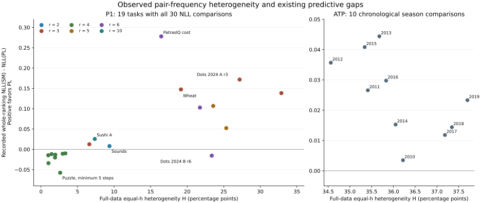

<!-- Generated by make_pair_feature_summary.py; edit methods in README.md. -->
# Full-data features beside recorded prediction gaps

[Definitions, interpretation and limitations](README.md) · [CSV](nll_comparison.csv) · [Every h](by_gap.csv)

H and H1 are **percentage points**, calculated from the entire task. H compares pairs only within the same h before aggregating; H1 restricts that comparison to adjacent pairs. Median count is the number of reports per observed pair × h cell. Δ is the saved SM-minus-PL whole-ranking NLL gap in nats/report. Counts and empirical frequencies are not estimates with a universal binomial CI.

## P1 datasets

The reference centers for all 23 tasks are certified full-data Kendall-objective minima. Original prediction fits and test losses are unchanged. Four incomplete means remain unavailable; conditional means use only the listed successful repetitions.

| Task / exact pair counts | H | H1 | Median count | Occurrences in cells with ≥5 reports | Δ | Finite repetitions | Conditional Δ if incomplete |
|---|---:|---:|---:|---:|---:|---:|---:|
| [Beans](pairs/beans.csv) | 6.61 | 5.34 | 31 | 99.9% | +0.01251 | 30/30 | — |
| [Sushi A](pairs/sushi_a.csv) | 7.36 | 8.07 | 5000 | 100.0% | +0.02555 | 30/30 | — |
| [Sushi B](pairs/sushi_b.csv) | 14.20 | 12.30 | 4 | 90.9% | Unavailable | 8/30 | +0.01086 |
| [Dots 2013, gap 3](pairs/00024-00000001.csv) | 1.96 | 2.26 | 795 | 100.0% | -0.01319 | 30/30 | — |
| [Dots 2013, gap 5](pairs/00024-00000002.csv) | 1.00 | 0.62 | 794 | 100.0% | -0.01466 | 30/30 | — |
| [Dots 2013, gap 7](pairs/00024-00000003.csv) | 1.45 | 1.57 | 800 | 100.0% | -0.01172 | 30/30 | — |
| [Dots 2013, gap 9](pairs/00024-00000004.csv) | 1.02 | 1.31 | 794 | 100.0% | -0.03407 | 30/30 | — |
| [Puzzle, minimum 11 steps](pairs/00025-00000001.csv) | 2.97 | 3.09 | 793 | 100.0% | -0.01077 | 30/30 | — |
| [Puzzle, minimum 5 steps](pairs/00025-00000002.csv) | 2.63 | 3.29 | 795 | 100.0% | -0.05756 | 30/30 | — |
| [Puzzle, minimum 7 steps](pairs/00025-00000003.csv) | 1.92 | 2.28 | 795 | 100.0% | -0.02021 | 30/30 | — |
| [Puzzle, minimum 9 steps](pairs/00025-00000004.csv) | 3.34 | 3.67 | 797 | 100.0% | -0.00996 | 30/30 | — |
| [Dots 2024 A r2](pairs/dots2024_A_r2.csv) | 27.34 | 27.34 | 1 | 0.0% | Unavailable | 14/30 | +0.20081 |
| [Dots 2024 A r3](pairs/dots2024_A_r3.csv) | 27.17 | 26.80 | 2 | 4.6% | +0.17177 | 30/30 | — |
| [Dots 2024 A r5](pairs/dots2024_A_r5.csv) | 23.56 | 21.32 | 2 | 42.7% | +0.10684 | 30/30 | — |
| [Dots 2024 A r6](pairs/dots2024_A_r6.csv) | 21.74 | 20.39 | 3 | 55.2% | +0.10285 | 30/30 | — |
| [Dots 2024 B r2](pairs/dots2024_B_r2.csv) | 33.46 | 33.46 | 1 | 0.0% | Unavailable | 23/30 | +0.10420 |
| [Dots 2024 B r3](pairs/dots2024_B_r3.csv) | 32.88 | 31.66 | 1 | 5.2% | +0.13834 | 30/30 | — |
| [Dots 2024 B r5](pairs/dots2024_B_r5.csv) | 25.34 | 24.64 | 2 | 43.6% | +0.05227 | 30/30 | — |
| [Dots 2024 B r6](pairs/dots2024_B_r6.csv) | 23.36 | 20.54 | 3 | 51.4% | -0.01556 | 30/30 | — |
| [Wheat](pairs/wheat.csv) | 19.15 | 19.62 | 7 | 87.4% | +0.14741 | 30/30 | — |
| [Sounds](pairs/sounds.csv) | 9.37 | 9.37 | 21 | 100.0% | +0.00797 | 30/30 | — |
| [PatrasIQ cost](pairs/patras_cost.csv) | 16.45 | 17.95 | 5 | 96.1% | +0.27794 | 30/30 | — |
| [PatrasIQ population](pairs/patras_population.csv) | 18.35 | 19.77 | 5 | 93.1% | Unavailable | 29/30 | +0.07527 |

## ATP yearly tasks

Each feature uses all completed, prior-catalogue-eligible matches in that year, including both halves and test matches whose players were unseen in training. Centers are approximate. Δ uses the existing T1 main seen-player July–December target: bounded/shrunk efficient-center SM versus ridge PL. Thus the feature population is broader than this prediction target; these values are not pooled with P1.

| Task / exact pair counts | H | H1 | Median count | Occurrences in cells with ≥5 reports | Δ | Seasonal comparisons | Conditional Δ |
|---|---:|---:|---:|---:|---:|---:|---:|
| [ATP 2010](pairs/atp_2010.csv) | 36.22 | 36.22 | 1 | 0.4% | +0.00347 | 1/1 | — |
| [ATP 2011](pairs/atp_2011.csv) | 35.41 | 35.41 | 1 | 1.1% | +0.02657 | 1/1 | — |
| [ATP 2012](pairs/atp_2012.csv) | 34.56 | 34.56 | 1 | 1.4% | +0.03568 | 1/1 | — |
| [ATP 2013](pairs/atp_2013.csv) | 35.68 | 35.68 | 1 | 1.1% | +0.04438 | 1/1 | — |
| [ATP 2014](pairs/atp_2014.csv) | 36.05 | 36.05 | 1 | 0.6% | +0.01526 | 1/1 | — |
| [ATP 2015](pairs/atp_2015.csv) | 35.34 | 35.34 | 1 | 0.8% | +0.04083 | 1/1 | — |
| [ATP 2016](pairs/atp_2016.csv) | 35.83 | 35.83 | 1 | 0.7% | +0.02976 | 1/1 | — |
| [ATP 2017](pairs/atp_2017.csv) | 37.18 | 37.18 | 1 | 0.2% | +0.01181 | 1/1 | — |
| [ATP 2018](pairs/atp_2018.csv) | 37.34 | 37.34 | 1 | 0.2% | +0.01439 | 1/1 | — |
| [ATP 2019](pairs/atp_2019.csv) | 37.70 | 37.70 | 1 | 0.2% | +0.02331 | 1/1 | — |

## Descriptive associations

These are correlations of dataset-level points, not additional experiments, significance tests, model-selection rules, or independent replication counts. Shared respondents/conditions, different r and cell support confound the pooled relationship. Incomplete P1 means are excluded; no conditional substitute is used. Only within-r groups with at least three complete tasks are listed.

| Points | Tasks | Pearson | Spearman |
|---|---:|---:|---:|
| P1_all_complete | 19 | +0.693 | +0.753 |
| P1_r3 | 4 | +0.835 | +0.400 |
| P1_r4 | 8 | +0.028 | +0.476 |
| P1_r6 | 3 | -0.983 | -1.000 |
| T1_ATP_seasons | 10 | -0.592 | -0.721 |

Axes differ between P1 and ATP. Every plotted point is a descriptive feature paired with an existing loss gap; no new confidence interval is computed.
