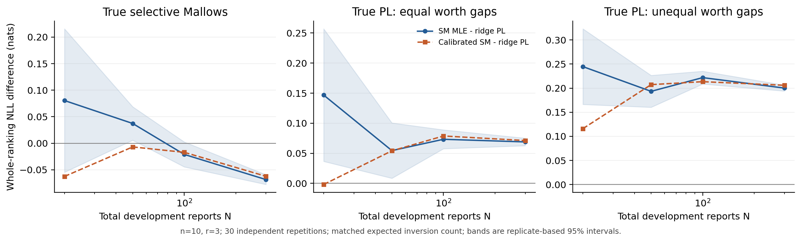

# Experimental design and results

The experiments answer a predictive question: **given the same training reports,
which model assigns better probabilities to a new whole ranking of its displayed
set?** They also separate optimization error, small-sample estimation, and model
structure. All numerical results below come from completed Python runs.

## Model and experimental priorities

For report t, let S_t be its displayed set and Y_t its strict ordering. The
selective Mallows law is

$$
P_{\mathrm{SM}}(Y_t\mid S_t;\pi,\beta)
=\frac{\exp[-\beta d_K(Y_t,\pi|_{S_t})]}{Z_{|S_t|}(e^{-\beta})}.
$$

This is the direct subset model in the supplied manuscript. PL uses

$$
P_{\mathrm{PL}}(Y_t\mid S_t;\theta)
=\prod_{k=1}^{r_t}\frac{e^{\theta_{Y_{tk}}}}
{\sum_{\ell=k}^{r_t}e^{\theta_{Y_{t\ell}}}}.
$$

We condition on the observed displayed set; no joint-probability comparison is
included. Real display mechanisms need not satisfy uniform sampling. Synthetic
sets are sampled independently and uniformly, then ranked directly within each
set. A latent full Mallows ranking followed by thinning would be a different model.

| Experiment | Question | Role |
|---|---|---|
| Center-optimization audit | Is SM likelihood optimized well enough? | Prevent an optimizer disadvantage from being misread as a model disadvantage |
| Real-data learning curves | Which model predicts new reports at the same budget? | Main applied comparison |
| Controlled simulations | How do truth and sample size change the comparison? | Check assumptions, sampling, and finite-sample behavior |
| Mechanism diagnostics | Which probability restrictions explain observed differences? | Exploratory interpretation of the main results |

## Estimators and optimization audit

For n = 10, exact subset DP minimizes
$D(\pi)=\sum_t d_K(Y_t,\pi|_{S_t})$ over all permutations. Profiling β then
fits dispersion. The preset bound is [0,10]; the 60 primary Beans/Sushi A fits
have interior dispersion solutions. Thus these are joint conditional MLE fits
up to numerical precision. Pair counts suffice to optimize D, without treating
pairs within a report as independent observations.

| Center method | Excess training D: Beans, N = 673 | Excess training D: Sushi A, N = 3,000 |
|---|---:|---:|
| Exposure-normalized Borda | 28 | 14 |
| FKS PosEst | 14 | 0 |
| Equal-reliability greedy MAL | 8 | 574 |
| Eight-start insertion | 0 | 0 |
| Exact subset DP | 0 | 0 |

These are benchmark training objectives, not error relative to a known true
center. DP took approximately 4–6 milliseconds on these two small instances.
Insertion also attained the optimum on all 360 synthetic instances, but has
no general global-optimality guarantee.

For n = 100, insertion plus a time-limited MILP audit is retained as one
approximate fitting pipeline. None of the 12 primary Sushi B fits is certified
globally optimal. A follow-up cutting-plane audit bounded one N = 3,000 instance
by **44,724 ≤ D_opt ≤ 44,736**. The gap of at most 12 concerns training D; it is
not a bound on test NLL. See [algorithm details and sources](algorithms.md).

The manuscript's sharp estimator is not a likelihood optimizer. It was not
part of this original benchmark; the [exposure extension](exposure_analysis.md)
now implements its exact sieve for small blocks. Small N does not reduce the
n! center search space. Neither exact optimization nor these simulations establishes that the
MLE attains the manuscript's sharp minimax risk lower bound.

## Fair comparison and uncertainty

The primary split randomly holds out 20% of whole reports. The remaining pool
supplies nested, shuffled training subsets. Five training repetitions are used
for Beans and Sushi A, and three for Sushi B. N includes all development
reports, including the inner 20% used for tuning; final fits use all N reports.
SM and PL use identical observations and test sets.

PL maximizes the full listwise penalized likelihood, with ridge coefficient
selected from {0.01, 0.1, 1, 10, 100}. It is a regularized fit, not an
unpenalized MLE. A prespecified SM sensitivity selects a multiplier
α ∈ {0, 0.25, 0.5, 0.75, 1} for β on inner validation data. Shrinkage changes
the probability concentration, not the final center. When α changes β, that
predictor is no longer the joint MLE; improved NLL is not a proof of formal
probability calibration.

The score is mean whole-ranking conditional NLL, in nats, with
Δ = NLL_SM − NLL_PL. Real-data CIs average the paired loss differences across
training repetitions **for each test report**, then bootstrap entire test
reports 2,000 times. The 2.5% and 97.5% quantiles give pointwise conditional
intervals. They exclude training uncertainty and unknown farmer clustering.
Synthetic CIs instead use a Student t interval over 30 independently generated
training/test repetitions. [Reproducibility notes](reproducibility.md) give details.

## Primary real-data results

| Dataset | N | SM NLL | PL NLL | Δ [95% CI] |
|---|---:|---:|---:|---:|
| Beans | 673 | 1.7925 | 1.7818 | 0.0107 [−0.0068, 0.0277] |
| Sushi A | 3,000 | 14.3078 | 14.2501 | 0.0577 [0.0179, 0.0988] |
| Sushi B, approximate SM | 3,000 | 14.2641 | 14.2658 | −0.0018 [−0.0506, 0.0435] |

PL has a modest predictive advantage on Sushi A in the primary split. Beans
and Sushi B do not show a resolved difference. Beans' uniform-ranking NLL is
log(6) = 1.7918, illustrating the weak signal captured by a single global
preference model. Do not compare absolute NLL values between r = 3 and r = 10.

At **Beans N = 20**, raw SM gives NLL 2.1227, PL 1.8475, and β-shrunk SM
1.8007. The SM center is already exact. The improvement comes from changing
concentration, not improving the center optimizer. Only four reports are
available for inner validation, so tuning is unstable; this is not a universal
small-sample advantage for SM.

## Controlled simulations

All simulations use n = 10, r = 3, randomized center labels, N ∈ {20,50,100,300},
30 independent repeats per setting, and 2,000 fresh test reports per repeat.
The DGPs are SM with β = 0.8, PL with equal latent gaps, and PL with unequal
gaps. PL scales match SM's expected inversion count of approximately 0.8267,
not its entire ranking entropy.

| Generating model, N = 300 | SM NLL | PL NLL | Δ [independent-repeat 95% CI] |
|---|---:|---:|---:|
| Selective Mallows | 1.5410 | 1.6094 | −0.0684 [−0.0776, −0.0592] |
| PL, equal gaps | 1.5529 | 1.4839 | 0.0689 [0.0627, 0.0752] |
| PL, unequal gaps | 1.5647 | 1.3645 | 0.2001 [0.1940, 0.2063] |

Under true SM at N = 50, raw SM still loses to PL by 0.0372 nats; after β
shrinkage the difference is −0.0069. Correct specification does not guarantee
the best finite-sample plug-in predictive likelihood. At N = 300 under true
SM, mean central Kendall error is 0.27 out of 45 for SM and 1.60 for PL.
Real datasets do not have a known true center for this comparison.

## Exploratory explanations and sensitivity

The [mechanism report](diagnostics.md) supplies definitions, exact computations,
and effective sample counts. Its main findings are:

- **Sushi A:** PL's nonuniform allocation of probabilities among rankings at
  the same Kendall distance contributes 0.0705 [0.0283, 0.1125] nats. The
  inversion-count component contributes −0.0128, giving total Δ = 0.0577.
  Constraining PL's order to the fitted SM center leaves a within-shell benefit
  of 0.0435 [0.0053, 0.0838], but the total-score interval includes zero.
- **Sushi B:** within fixed pairs, observed win probability changes by only
  0.26 [−0.40, 0.95] percentage points per additional displayed center gap;
  fitted SM predicts 3.68, whereas PL predicts zero. Region-stratified results
  are similar. This local diagnostic favors PL's structure; whole-ranking NLL
  still does not identify an overall winner.
- **Beans:** mechanism intervals are wide. At N = 20, β shrinkage changes only
  the inversion-count part of the likelihood, accounting for its entire gain.

Other completed checks are explicitly exploratory. Five disjoint test folds
give positive Δ for Beans (0.0072–0.0215; pooled 0.0168) and Sushi A
(0.0028–0.0599; pooled 0.0317). These are descriptive fold comparisons, not
independent-replicate CIs. Beans 2015-to-2016 transfer gives raw Δ = 0.0140
[0.0023, 0.0254], shrinking to 0.0093 [−0.0037, 0.0224] with β shrinkage.
Regularization materially affects the interpretation.

## Limitations and next experiments

Real subset allocation is not uniform; Beans lacks farmer IDs; Sushi A/B share
respondents; large-instance SM is approximate; and intervals are exploratory
and unadjusted for multiple comparisons. Diagnostics reuse the original test
set and estimated centers. They are neither an independent confirmation nor
a causal analysis.

The highest-value next experiments are an independent participant sample to
check Sushi A's within-shell heterogeneity, and controlled presentation of the
same pairs in different sets to distinguish SM context effects from assessor
heterogeneity. A minimax-rate study would require a separate design satisfying
the theorem's exposure and intermediate-information conditions. The present
n = 10 simulations do not validate that rate theorem.

All research/data sources are in [References](references.md). The initial
[protocol](protocols/PROTOCOL.md), [diagnostic protocol](protocols/DIAGNOSTIC_PROTOCOL.md),
and post-diagnostic [addendum](protocols/DIAGNOSTIC_ADDENDUM.md) are preserved.
