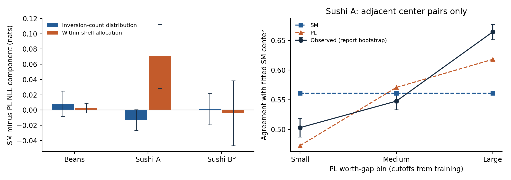

# Why do SM and PL predict differently?

These diagnostics were added after inspecting the primary comparisons. They
reuse the saved training fits and original held-out reports, so they are
**exploratory**. Centers, worths, dispersion, and bin cutoffs are learned from
training data. Only conditional probabilities are evaluated.

## 1. Pair reliability at the correct displayed distance

Let h be the position difference between two items in the fitted center
restricted to S, and orient the pair to agree with that center. The direct
subset SM pair probability is

$$
p_{\mathrm{SM}}(h,\beta)=\frac{h+1}{1-e^{-(h+1)\beta}}
-\frac{h}{1-e^{-h\beta}},
\qquad p_{\mathrm{PL}}(i,j)=\frac{e^{\theta_i}}{e^{\theta_i}+e^{\theta_j}}.
$$

The β = 0 limit is 1/2. For a directly displayed pair, h = 1 and SM has common
success probability logistic(β). None of our real tasks has r = 2. Extracted
pairs from longer rankings must therefore be evaluated using their actual h.

To compare pairs at equal h, take only h = 1 and split their PL worth gaps into
three bins using training occurrences. Test observations and predicted rates
for Sushi A are:

| PL gap bin | Small | Medium | Large |
|---|---:|---:|---:|
| Observed agreement with fitted SM center | 50.3% | 54.8% | 66.4% |
| SM prediction | 56.1% | 56.1% | 56.1% |
| PL prediction | 47.3% | 57.1% | 61.8% |

The observed heterogeneity at equal h is unavailable to a single SM β. PL can
express it, although PL is not perfectly calibrated either. A fitted center
does not supply the true preference direction. Pair log loss and Brier loss
are averaged within reports before aggregation and resampling; pairs are not
treated as independent samples.

## 2. Exact decomposition by Kendall-distance shell

Fix the training-estimated SM center. Write D = d_K(Y, π|S), and let a_r(d) be
the number of permutations at distance d. SM is uniform within every shell:
$P_{\mathrm{SM}}(Y\mid D=d,S)=1/a_r(d)$.

Compute PL shell mass $Q_{\mathrm{PL}}(D=d\mid S)$ exactly, and define

$$
Q_{\mathrm{sym}}(Y\mid S)=
\frac{Q_{\mathrm{PL}}(D=D(Y)\mid S)}{a_r(D(Y))}.
$$

This averages PL probabilities within each shell while retaining its shell
mass. It is a normalized diagnostic distribution, not a newly fitted competitor.
For every report,

$$
\underbrace{\mathrm{NLL}_{SM}-\mathrm{NLL}_{PL}}_{\Delta}
=\underbrace{\mathrm{NLL}_{SM}-\mathrm{NLL}_{sym}}_{\text{shell mass}}
+\underbrace{\mathrm{NLL}_{sym}-\mathrm{NLL}_{PL}}_{\text{within shell}}.
$$

The components sum exactly; they are not independent effects. The PL shell
distribution uses subset/polynomial DP. Index items in restricted center order;
with H_empty(z) = 1, its recurrence is

$$
H_A(z)=\sum_{i\in A}\frac{w_i}{\sum_{j\in A}w_j}
z^{|\{j\in A:j<i\}|}H_{A\setminus\{i\}}(z).
$$

Coefficient d gives the probability of d inversions. The implementation uses
batches and exact finite-state summation for report sizes up to ten. This
project implements the diagnostic; it does not claim a new theoretical estimator.

| Dataset / N | Total Δ | Shell-mass component | Within-shell component [95% CI] |
|---|---:|---:|---:|
| Beans / 673 | 0.0107 | 0.0079 | 0.0028 [−0.0038, 0.0091] |
| Sushi A / 3,000 | 0.0577 | −0.0128 | 0.0705 [0.0283, 0.1125] |
| Sushi B / 3,000 | −0.0018 | 0.0018 | −0.0036 [−0.0466, 0.0384] |

Sushi A's PL gain comes from its allocation within shells. SM's shell-mass
component has CI [−0.0266, 0.0003], so its small point advantage is unresolved.
A post-diagnostic sensitivity constrains PL's worth ordering to the SM center,
allowing ties, and refits on the original training data. The within-shell
component remains 0.0435 [0.0053, 0.0838]; total Δ = 0.0356
[−0.0010, 0.0756]. Thus an overall advantage under this constraint is not resolved.

Direct frequency tests would be sparse: Beans has 169 test reports on 91 sets
(only two sets occur at least five times), Sushi A has 1,000 reports on one set,
and Sushi B has 1,000 reports on 1,000 sets. The predictive decomposition avoids
pretending that each complete permutation has a well-estimated empirical frequency.

## 3. Context variation within the same item pair

Let Z indicate agreement with the fitted SM center. Within a cell c, estimate
the slope of Z on displayed gap h:

$$
\widehat\gamma=
\frac{\sum_c\sum_{t\in c}(h_t-\bar h_c)(Z_t-\bar Z_c)}
{\sum_c\sum_{t\in c}(h_t-\bar h_c)^2}.
$$

Cells are fixed pairs, or pair × season/region for sensitivity. A cell is
eligible if at least two different gaps each have at least two observations.
Eligibility uses displays, not pair outcomes. Replacing Z with model probabilities
gives the predicted slope under identical exposures. PL's slope is zero because
its probability for a fixed pair does not depend on other displayed items.

| Task / cells | Observed percentage-point change per gap [95% CI] | SM | PL |
|---|---:|---:|---:|
| Beans / pair | 1.64 [−10.55, 15.17] | 2.43 | 0 |
| Beans / pair × season | 4.73 [−12.12, 23.48] | 2.43 | 0 |
| Sushi B / pair | 0.26 [−0.40, 0.95] | 3.68 | 0 |
| Sushi B / pair × current east/west region | 0.43 [−0.29, 1.15] | 3.69 | 0 |

Sushi A has no within-pair displayed-gap variation; this diagnostic is not
applicable. Beans' seasonal check has only 17 eligible cells, 15 pairs, and
101 contributing reports, producing wide intervals. Sushi B has approximately
1,841–1,882 eligible pairs across fitted centers and all 1,000 test reports.

Sushi B's observed effect is much weaker than fitted SM predicts. Its binary
pair log-loss difference is 0.0071 [0.0048, 0.0096], favoring PL. This local
finding does **not** imply an overall whole-ranking advantage: that primary CI
includes zero. Region stratification controls only one observed characteristic;
assessor heterogeneity and approximate-center error remain possible influences.

## 4. Small-sample dispersion

At Beans N = 20, raw Δ = 0.2752 decomposes into 0.2932 for shell mass and
−0.0180 within shells. After the prespecified β shrinkage, these become
−0.0288 and −0.0180, giving Δ = −0.0468. The center and within-shell
allocation do not change. Algebraically, the entire gain is a change in
inversion-count probabilities. This does not by itself establish formal
calibration or a general small-sample ranking of the models.

## Verification and interpretation limits

Exhaustive permutations for r = 3,4,5,6 verify pair marginals, Mahonian counts,
PL shell DP, and the decomposition. Maximum shell-probability error in the
recorded run was 1.11e−16. Known-parameter positive controls use 10,000 reports
per model and displayed set. For sets {0,1,2} and {0,2,3}, SM at q = 1/2 gives
observed pair probabilities 0.7661 and 0.6697 (theory 16/21 and 2/3). PL with
worths (16,4,1,0.25) gives 0.9410 and 0.9388 (theory 16/17 in both sets).

Intervals use 2,000 whole-report bootstrap draws conditional on the saved fits.
The same report draws combine training repetitions, and within-cell means are
recomputed per draw. Eligible cells are held fixed. The diagnostic seed differs
from the primary seed, so bootstrap endpoints may differ slightly for the same
point estimate. No primary table is replaced by diagnostic intervals.

These are predictive checks about estimated centers, not causal effects or
omnibus goodness-of-fit tests. They reuse held-out data after the primary
results, do not adjust for multiple comparisons, and do not include training
or unknown farmer-cluster uncertainty. All outcomes are retained, including
those that favor different models on different criteria.

Sources: the supplied manuscript's Lemma 2.3 and model definition; the
algorithm and dataset sources in [References](references.md). The shell
identity, finite-state computation, and within-cell slope are explicitly
defined here. See the preserved [protocol](protocols/DIAGNOSTIC_PROTOCOL.md)
and [addendum](protocols/DIAGNOSTIC_ADDENDUM.md).
