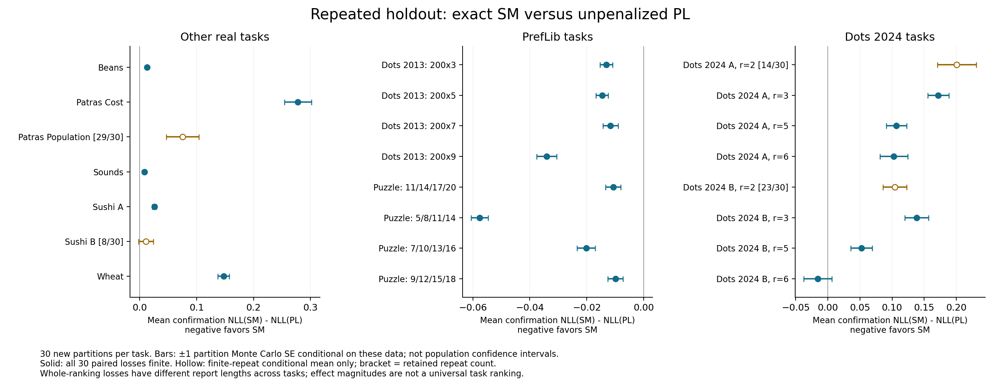

# Findings across the study

[Design](experiments.md) · [Data](../data/README.md) · [Criteria](criteria.md) · [Uncertainty](uncertainty.md) · [Complete tables](../results/README.md)

Throughout, $`\Delta=\mathrm{NLL}(\mathrm{SM})-\mathrm{NLL}(\mathrm{PL})`$; negative favors SM. The conclusions below concern specified fitted procedures and evaluation populations. Predictive advantage does not identify a generating model, and loss magnitudes across different ranking lengths are not directly comparable measures of dataset importance.

## Empirical prediction

P1 averages 30 complete fits on randomized 60/20/20 partitions. The table uses the exact/certified-center SM candidate against unpenalized PL on confirmation reports. MCSE describes precision over partitions of the fixed dataset; it is **not a population CI**. Complete mean comparisons are available for 19 of 23 tasks.

| Task | Mean Δ | Partition MCSE | Finite paired repetitions | Conditional mean if incomplete |
|---|---:|---:|---:|---:|
| Dots 2013, gap 3 | -0.01319 | 0.00221 | 30/30 | — |
| Dots 2013, gap 5 | -0.01466 | 0.00212 | 30/30 | — |
| Dots 2013, gap 7 | -0.01172 | 0.00264 | 30/30 | — |
| Dots 2013, gap 9 | -0.03407 | 0.00350 | 30/30 | — |
| Puzzle, minimum steps 11 | -0.01077 | 0.00263 | 30/30 | — |
| Puzzle, minimum steps 5 | -0.05756 | 0.00301 | 30/30 | — |
| Puzzle, minimum steps 7 | -0.02021 | 0.00318 | 30/30 | — |
| Puzzle, minimum steps 9 | -0.00996 | 0.00267 | 30/30 | — |
| Beans | +0.01251 | 0.00166 | 30/30 | — |
| Dots 2024 A r2 | Unavailable | — | 14/30 | +0.20081 |
| Dots 2024 A r3 | +0.17177 | 0.01645 | 30/30 | — |
| Dots 2024 A r5 | +0.10684 | 0.01590 | 30/30 | — |
| Dots 2024 A r6 | +0.10285 | 0.02151 | 30/30 | — |
| Dots 2024 B r2 | Unavailable | — | 23/30 | +0.10420 |
| Dots 2024 B r3 | +0.13834 | 0.01859 | 30/30 | — |
| Dots 2024 B r5 | +0.05227 | 0.01680 | 30/30 | — |
| Dots 2024 B r6 | -0.01556 | 0.02202 | 30/30 | — |
| PatrasIQ cost | +0.27794 | 0.02371 | 30/30 | — |
| PatrasIQ population | Unavailable | — | 29/30 | +0.07527 |
| Sounds | +0.00797 | 0.00249 | 30/30 | — |
| Sushi A | +0.02555 | 0.00353 | 30/30 | — |
| Sushi B | Unavailable | — | 8/30 | +0.01086 |
| Wheat | +0.14741 | 0.01004 | 30/30 | — |

The four incomplete comparisons have informative failure patterns: Sushi B lacks an exact-center certificate in 22 repetitions; dots2024 A/B at r=2 lack a usable finite PL fit in 16/7; PatrasIQ population lacks one in a single repetition. The full paired mean is therefore unavailable. A conditional mean over successful cases cannot stand in for overall performance. All candidate methods, statuses and finite-report alternatives remain in [the full score table](../results/repeated_holdout/scores.csv).

Puzzle with minimum five solution steps gives the largest SM-favorable mean among these four-item conditions. PatrasIQ cost, wheat and several dots2024 tasks favor PL in the observed repeated mean. These are comparisons conditional on the available source samples, without a population significance claim or multiple-comparison correction. Item/participant mixtures and physical-stimulus coding qualify their interpretation.

The bars are ±1 partition MCSE. The plot also labels incomplete-fit cases; read their denominators before interpreting a point.

P2 answers the complementary fixed-fit question. Its Sounds exact-SM difference is +.01919 with person-bootstrap interval [−.00884,.04330]; PatrasIQ cost is +.08173 [−.12933,.30613]; population is +.06407 [−.17458,.31015]. Those intervals condition on one training allocation and do not attach to the P1 means. Different center estimators can change the comparison: for example, P2 PatrasIQ cost clipped-Borda SM has +.32047 [.05951,.54920]. [P2](baseline_replacement.md) and [the output dictionary](../results/validation_extension/README.md) preserve every candidate.

## Full-data ranking characteristics

The [data-feature catalogue](../data/features/README.md) describes each entire empirical task at equal displayed-center gap h. Dots 2013 and Puzzle have occurrence-weighted cross-pair frequency dispersion H of approximately 1.00–3.34 percentage points, with about 800 observations per relevant pair; all eight P1 mean NLL gaps favor SM. Sushi A has H=7.36 points with 5,000 observations per pair, and its P1 gap is +.02555. PatrasIQ cost has H=16.45 points and gap +.27794, but median pair × h support is only five observations.

This descriptive relationship is not universal. dots2024 B at r=6 has H=23.36 points and a slightly SM-favorable gap −.01556. Most dots2024 cells have only one to three observations, so large raw dispersion cannot be read as noise-free population heterogeneity. Pooled correlations also change substantially when restricted to the same ranking length. [All 33 task comparisons, support counts, unavailable NLLs and separate ATP targets](../data/features/comparison.md) are published. These characteristics use full-data reference centers and are not additional prediction experiments or independent model tests.

[Characteristic 2](../data/features/structure/comparison.md#2-same-display-same-kendall-distance-shell) compares actual ordering frequencies within each exact display and Kendall shell, including possible orders never observed. Sushi A's mean total variation is .99351, but its nominal iid-uniform sampling reference is already .99335: the possible-order space is too large to read its raw value as strong nonuniformity. Puzzle's minimum-5-step task has TV .09677 versus nominal reference .06450 while its existing NLL gap −.05756 favors SM. Departures from a model constraint need not reverse its relative predictive advantage, and the nominal reference is not a calibrated test.

[Characteristic 3](../data/features/structure/comparison.md#3-same-pair-across-exact-displayed-sets) compares the same pair across exact displays. Replacing one other item to increase h gives Beans a count-weighted +2.66 percentage-point change over 420 contrasts, all with repeated displays; its NLL gap +.01251 still favors PL. Wheat gives +7.56 points and gap +.14741, but only 70 of 2,022 contrasts have both displays repeated. In dots2024 B r=6, the one-item replacement mean is −33.33 points from 30 contrasts with no such repeated-display support, whereas the broader within-pair slope is positive. These different summaries and their support cannot be reduced to a universal rule for the NLL winner. Fixed full displays provide no same-pair context comparison, and r=2 has neither a nontrivial shell constraint nor a same-pair display contrast.

## Trial and assessor heterogeneity

At the same training count, local Puzzle fitting improves both SM and PL by approximately .11–.14 nats per report relative to matched pooled training. With the much larger full pooled training sample, that local advantage usually disappears. Relative SM–PL interactions change sign across Puzzle conditions and all their primary split ranges include zero. Group information can improve prediction without establishing that one family is consistently more group-sensitive.

The Sounds person-local setting has only 21 training pairs per assessor. A usable finite PL fit exists in 28 of 4,600 local contexts; SM also has missing-item exclusions and infinite test losses. The tiny finite intersection cannot support an overall personal-model winner. Pooled prediction for held-out people remains a meaningful separate target. [G1](group_sensitivity.md) provides per-condition tables, equal-budget controls, coverage and 5th–95th split ranges.

## Sample size and regularization

L1/L2 vary N while holding each task and outer test fixed. They show how learning, item exposure, dispersion shrinkage and PL penalty selection can change prediction. The complete Sushi A/B curves and small-budget Sushi B comparisons are linked in [the learning-curve chapter](learning_curves.md); there is no need to infer a sample-size trend by comparing unrelated datasets.

For the bounded, unshrunk exact-center SM versus tuned ridge PL at Sushi A N=3,000, Δ is +.0577 with conditional test-bootstrap interval [.0179,.0988]. The corresponding Sushi B comparison is close to zero and uses an uncertified approximate center. Neither result is numerically interchangeable with the unpenalized P1 comparison. At Sushi B N=100, a fixed stronger PL penalty substantially changes the apparent small-budget model advantage, showing why tuning must be included in the procedure definition.

## Controlled mechanisms

S1's fixed-shell intervention isolates an aspect of ranking structure that total noise does not describe. For n=8,r=3,N=448 and equal-gap reference PL, every intervention retains mean inversions .826685 and the full inversion-count distribution, yet the mean exact-SM-minus-PL difference changes as follows:

| Within-shell tilt h | Mean Δ | 95% interval across 40 independent training draws |
|---:|---:|---|
| 0 | −.0555 | [−.0577,−.0533] |
| .5 | −.0270 | [−.0295,−.0245] |
| 1 | −.0026 | [−.0052,.0000] |
| 2 | +.0388 | [.0350,.0426] |
| 4 | +.0708 | [.0685,.0732] |

The final displayed zero is rounded. The conclusion is a controlled predictive reversal as probability allocation within shells changes, not proof that a single empirical context slope identifies the preferred model. The bridge, shell and coverage grids preserve finite-MLE failures and divergent losses. At n=32,N=40, all PL fits in each coverage mixture cell lack a unique finite MLE. [Simulation design and exact outputs](strict_feature_analysis.md).

## Diagnostic calibration

Estimated-center error attenuates or changes the apparent SM context effect. The heterogeneous-PL control produces a nonzero pooled effect through assessor/display association even though each group is PL and has zero within-group context effect. Adjusting by true group removes the population effect, but its sample bootstrap can fail when overlap is sparse.

At confounding strength .90 and diagnostic budget 60, only 143/200 adjusted diagnostics exist, and 30.8% of those reject the true zero effect using nominal 95% intervals. At budgets 200 and 1,000, availability/rejection are 199/200 with 7.5% and 200/200 with 3.0%. This is evidence against treating the diagnostic's nominal interval as a universally calibrated test. [D2](validation_extension.md) distinguishes inner bootstrap intervals from outer Wilson rate intervals.

Wheat's context support is small and its clustering metadata incomplete. The SP-Rank objective-gap screen has no eligible changing-gap pairs. No reliable positive empirical identification of the selective-Mallows context mechanism follows from these analyses. [Observation-design limits](context_followup.md).

## Temporal and structural controls

ATP's ten equal-weight season means favor ridge PL: the bounded/shrunk efficient-center SM difference is +.02455 with working across-season interval [.01497,.03412]. Fixing SM to PL's fitted order still gives +.02169 [.01340,.02997]. This is consistent with pair-specific strength differences helping beyond a common order. The intervals do not resolve dependence from recurring players and years. [Temporal design and tables](temporal_prediction.md).

On Sushi A, a common-order control still favors PL in a conditional comparison; within-shell probabilities can help even when the fitted order is held fixed. Optimization benchmarks and Sushi B objective bounds explain which comparisons are exact and which use approximations. Their bounds apply to training objectives, not predictive loss. [Structural controls](structural_controls.md).

These findings leave distinct open questions: sampling-population uncertainty for the complete repeated-fit procedure, unidentified participant dependence, uniform-display theorem applicability, performance of active multilevel estimator hierarchies, and robust model selection from sparse context data. The study records these limitations alongside the results rather than treating repeated shuffles as additional people or corrected metadata as new observations.
