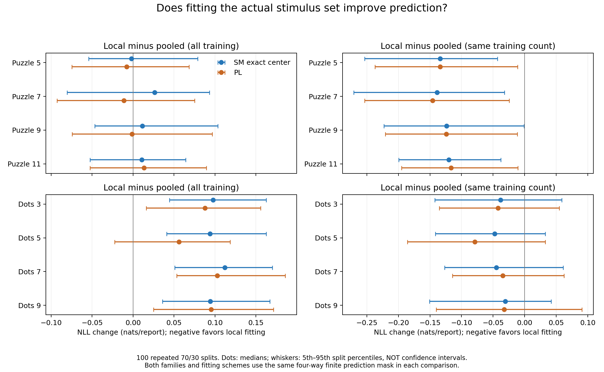
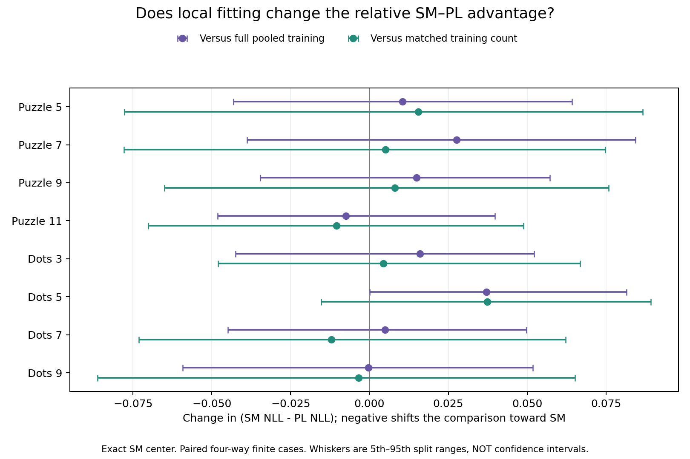

# 题组与受试者敏感性实验（2026-09-27）

你的设计可以回答“按题组分别拟合是否改善预测、是否改变 SM 与 PL 的相对表现”。本次已实际完成全部 9 个任务。需要补充一个控制：分题组后，每个模型可用的训练样本会变少，因此另外比较了**训练样本数相同的混合组模型**。结果表明，Puzzle 中两个模型都能从同题组数据中获益，但当前结果不足以得出其中一个模型始终更受题组影响。

这是对固定真实数据的重复划分研究。下面的百分位范围表示 shuffle 敏感程度，不是总体置信区间；100 次划分不是 100 批独立受试者。

## 数据与“同一题组”的含义

- **Puzzle**：4 个难度条件，每个条件 40 个原始题组，共 3,180 条四项完整排序。Puzzle-5 的项目步数为 5、8、11、14；Puzzle-7 为 7、10、13、16；Puzzle-9 为 9、12、15、18；Puzzle-11 为 11、14、17、20。四个条件分别实验，不合并。
- **Dots（2013）**：4 个条件，每个条件 40 个原始题组，共 3,183 条四项完整排序；不是 dots2024。作为题组实验的补充比较。
- **Sounds**：46 个原始受试者，每人 30 条两两比较，共 1,380 条，项目全集大小为 12。用于受试者实验。

Puzzle/Dots 的原始题组来自 [Andrew Mao 的数据页面](https://www.andrewmao.net/code/)链接的 [voting-results.tar.gz](https://dl.dropboxusercontent.com/s/mf0mm153pe3f12w/voting-results.tar.gz)。同一个原始文件对应同一组实际刺激材料，文件中的行是对这个题组的重复报告。因此分题组实验不再把“步数相同但来自其他题组的棋盘”混在一起。已逐一验证 8 个条件的全部 24 种排序频数，与当前固定版本的 PrefLib 数据完全一致。

**仍未获得实际棋盘布局或全局棋盘编号，也未获得 Puzzle/Dots 可跨题组关联的受试者 ID。** 这里恢复的是原始 trial 成员关系，不能判断不同 trial 是否复用了某个棋盘，更不能保证不同 trial 的受试者互不重叠。以步数为客观标签的排序仍然成立，但相同步数的实际棋盘可能有不同的感知难度。

Sounds 来自仓库已经固定版本的 BayesMallows 数据，含真实源数据 assessor 字段。没有为其他数据猜测身份。Sushi、dots2024、Patras 在各自单独拟合的任务内没有本实验所需的每人多条重复报告；不同项目全集或不同任务不能为了增加每人样本量而直接合并。

完整来源及 SHA256 见 [来源清单](../data/group_sensitivity_sources.json)、[既有 Sounds 来源](../data/validation_extension_sources.json)。原始记录和逐条训练成员缓存保留在本地；仓库发布汇总结果，不新增原始受试者排序的再分发。

## 实际运行的设计

设计在生产实验前固定于[协议提交 6954105](https://github.com/hyj55/mallowsmodel/commit/69541057711c08ff1508f25676bb6abfdd12c27d)。根种子为 `202609270`，随机流由任务、比例、重复编号、用途及组编号分别确定。

1. **主要分析：100 次 70/30 划分。** 每个题组/受试者内部随机打乱完整报告，训练数量为 `floor(0.7 × 该组报告数)`，其余用于测试。每一组都出现在训练和测试中。比例因整数取整略有差别，未按模型成功与否重新抽样。
2. **样本量敏感性：50/50、80/20 各 20 次。** 同样保留所有报告，不拆散一条排序，也不按拟合结果筛选 split。
3. 每次划分，在**同一批测试报告**上比较 `pooled`（全部组的训练报告）、`local`（只用目标组的训练报告）、`matched_pool`（从全部训练报告中无放回抽取与目标组训练量相同的报告）。后者可以抽到目标组报告；它代表同样数据预算下的混合训练，不是“仅其他组”训练。
4. **另做 100 次整组 70/30 留出**，训练题组与测试题组完全不同。Sounds 同理留出完整受试者。这回答新题组/新人预测问题，和“已见过的组的新报告”是不同预测目标。

年份、温度等不参与模型拟合。组标签仅用于划分、选择对应的局部模型及结果汇总，SM 与 PL 得到相同信息。分组预测需要在预测时知道题组/受试者身份；局部模型的总体参数量更大。题组留出不等于受试者留出，因为 Puzzle/Dots 缺少跨组人的 ID。

## 估计器适用性

| 方法 | 本次处理 |
|---|---|
| SM exact MLE 中心 | n=4 和 n=12 均可精确求解，无需近似替代。按子集大小批量计算同一个动态规划递推，保持原有最优目标值和并列顺序。缺少完整两两覆盖不妨碍 Kemeny 最小值存在；本次保守地跳过训练中有完全未出现项目的拟合。 |
| Fotakis Algorithm 1 / PosEst | 只在每个项目对都至少共同出现一次时运行；记录经验 p-frequent 覆盖率。Puzzle/Dots 满足，Sounds 个人子样本不满足。它是中心估计器，不是 MLE，随后仍按同一似然估计 beta。 |
| §2 Sharp | 按本次预先记录的保守规则，排除 `lambda=N*r*(r−1)/(n*(n−1))>1` 的情形：这是论文稀疏定理的适用范围限制，**不是说算法在范围外无法算出排序**。因此四项完整排序的 Puzzle/Dots 不运行 Sharp。 |
| §3 efficient | Sounds 个人子样本可落在 lambda≤1 内；但 n=12 超过现有 Sharp 精确 sieve 的大小 8 限制，所以按你的授权使用 §3 替代，并要求每个项目都出现。本次实际均走 0 层分支，不能宣称验证了多层算法优势。 |
| PL | 保留原有未正则化 Hunter MM。要求有向比较图强连通及数值收敛，不添加伪计数来救活失败拟合。 |

均使用原有条件排序似然及不封顶的 SM beta 剖面估计。beta 无穷且测试排序违反拟合中心时，预测损失无穷大，原样保留。缺失估计与无穷损失分开记账。没有根据测试结果换中心算法、截断 beta、删除未观察项目或丢弃困难的划分。

独立报告、均匀展示子集、真实 beta 下界和定理中的未知常数 C0 等条件未在真实数据上得到证明。覆盖检查是必要审计，不是理论恢复保证。整个实验仍是仓库声明的未正则化比较，不能称作论文完整 Algorithm 4.1 的逐字复现。

## 模型比较结果

下表是 100 次 70/30 的平均 `delta = NLL(SM exact) − NLL(PL)`，单位 nats/报告。负数表示 SM 更好，正数表示 PL 更好。各列在该方案内两模型都有有限预测的报告上计算；**跨列的严格比较请看下一张四方共同样本表**，不能直接忽略各列覆盖差异。

| 数据 | 混合 pooled | 同题组 local | 等样本混合 matched | 整组留出 pooled |
| --- | --- | --- | --- | --- |
| puzzle-5 | -0.0571 | -0.0482 | -0.0585 | -0.0572 |
| puzzle-7 | -0.0143 | +0.0113 | +0.0047 | -0.0191 |
| puzzle-9 | -0.0094 | +0.0053 | +0.0004 | -0.0106 |
| puzzle-11 | -0.0110 | -0.0175 | -0.0084 | -0.0123 |
| dots-3 | -0.0129 | -0.0007 | -0.0050 | -0.0147 |
| dots-5 | -0.0167 | +0.0220 | -0.0136 | -0.0182 |
| dots-7 | -0.0126 | -0.0080 | +0.0009 | -0.0128 |
| dots-9 | -0.0313 | -0.0312 | -0.0260 | -0.0364 |

Puzzle-5 的混合训练优势最清晰，delta 的 5%–95% 划分范围为 [-0.0773, -0.0356]；分题组后为 [-0.0995, +0.0073]。Puzzle-7、Puzzle-9 的平均优胜方向改变，但局部样本少、随机划分范围跨零，不应称为稳定反转。Dots-5 也是值得注意的方向变化。

## 分题组本身是否改善预测

下面每个比较都要求同一报告上“SM 局部、PL 局部、SM 参照、PL 参照”四个预测都有限。负数表示局部拟合损失更低。最后一列是等样本比较的共同有限报告覆盖率。

| 数据 | SM: local−pooled | PL: local−pooled | SM: local−matched | PL: local−matched | 共同覆盖 |
| --- | --- | --- | --- | --- | --- |
| puzzle-5 | +0.0040 | -0.0049 | -0.1285 | -0.1386 | 99.44% |
| puzzle-7 | +0.0187 | -0.0071 | -0.1327 | -0.1391 | 99.38% |
| puzzle-9 | +0.0177 | +0.0030 | -0.1162 | -0.1212 | 99.65% |
| puzzle-11 | +0.0097 | +0.0162 | -0.1212 | -0.1121 | 100.00% |
| dots-3 | +0.0997 | +0.0876 | -0.0392 | -0.0435 | 100.00% |
| dots-5 | +0.0935 | +0.0549 | -0.0459 | -0.0814 | 100.00% |
| dots-7 | +0.1113 | +0.1066 | -0.0354 | -0.0266 | 99.95% |
| dots-9 | +0.0985 | +0.0984 | -0.0349 | -0.0297 | 100.00% |

**对于 Puzzle，控制训练样本量后，同题组数据对两个模型都更有用。** 平均改善约为 0.11–0.14 nats/报告。但相对于使用所有组的大训练集，主要 70/30 实验中的改善很小或消失。因而“分组拟合反而更差”不能直接解释为“题组没有影响”，还要考虑训练量减少。

Dots 的同组优势在等样本比较中较小，约 0.03–0.08；全部组训练的预测则总体更好。本次 50%、70%、80% 三种训练比例下，四个 Puzzle 条件的等样本比较中，两模型平均局部改善方向都为负。50% 时全数据混合训练的优势更明显；80% 时部分局部方案反而较好，说明结论依赖每组可用训练量。

## 哪个模型更受题组影响

使用差中之差：`interaction = (SM_local − PL_local) − (SM_reference − PL_reference)`，仍在四方共同有限样本上计算。负数表示分组让比较更偏向 SM，正数表示更偏向 PL。以下括号为 5%–95% 划分范围。

| 数据 | 相对全数据混合 | 划分范围 | 相对等样本混合 | 划分范围 |
| --- | --- | --- | --- | --- |
| puzzle-5 | +0.0089 | [-0.0432, +0.0642] | +0.0101 | [-0.0777, +0.0867] |
| puzzle-7 | +0.0257 | [-0.0388, +0.0844] | +0.0064 | [-0.0778, +0.0748] |
| puzzle-9 | +0.0147 | [-0.0346, +0.0572] | +0.0050 | [-0.0650, +0.0759] |
| puzzle-11 | -0.0065 | [-0.0481, +0.0398] | -0.0091 | [-0.0701, +0.0488] |
| dots-3 | +0.0122 | [-0.0425, +0.0521] | +0.0043 | [-0.0480, +0.0668] |
| dots-5 | +0.0387 | [+0.0001, +0.0816] | +0.0356 | [-0.0154, +0.0892] |
| dots-7 | +0.0046 | [-0.0449, +0.0498] | -0.0088 | [-0.0732, +0.0622] |
| dots-9 | +0.0001 | [-0.0592, +0.0519] | -0.0052 | [-0.0863, +0.0651] |

四个 Puzzle 条件的交互方向不统一，范围均跨零。目前更稳妥的表述是：**题组信息有预测价值，但没有稳定证据表明它总是更有利于 SM 或 PL。** Dots-5 在全训练量参照下更偏向 PL，划分范围几乎全部为正；但等样本参照的范围跨零，且涉及多个条件，不能据此作总体显著性结论。

这仍不是棋盘身份的因果效应：题组可能同时关联感知难度、受试者构成和其他未记录条件；局部拟合也增加了整个系统的参数量。

## Fotakis 与 exact 的差异

本次不根据测试结果挑选最有利的方法。预定主要分析使用 exact，Fotakis 全部单独报告。下表是局部拟合的 SM−PL 差值。

| 数据 | SM exact−PL | SM Fotakis−PL |
| --- | --- | --- |
| puzzle-5 | -0.0482 | -0.0707 |
| puzzle-7 | +0.0113 | -0.0032 |
| puzzle-9 | +0.0053 | +0.0015 |
| puzzle-11 | -0.0175 | -0.0298 |
| dots-3 | -0.0007 | -0.0097 |
| dots-5 | +0.0220 | +0.0087 |
| dots-7 | -0.0080 | -0.0294 |
| dots-9 | -0.0312 | -0.0559 |

Fotakis 的小样本局部预测经常比 exact 更好，尤其 Dots-7、Dots-9；训练似然最优不意味着测试似然最优。这也说明“SM 对题组的敏感性”需要注明所用中心估计器。完整逐组结果包含全部候选估计器及排除原因。

## 受试者实验：Sounds 的边界问题

已运行 Sounds 的同样设计，没有因结果不好而略去。主要分析共有 46×100=4,600 个个人训练场景，每人用 21 条训练、9 条测试。

- PL 仅 **28/4,600（0.61%）** 有可用有限唯一 MLE，其余 4,572 个有向图不强连通；等样本混合训练也仅 9/4,600 可用。
- Exact SM 中，454 个场景因有项目完全未出现而按协议排除；4,146 个可拟合场景中，1,531 个至少有一条测试报告损失为无穷大。其余 2,615 个场景全部测试损失有限。
- §3 efficient 允许的 4,146 个场景全部为 0 层；其中 420 个场景有无穷测试损失。Fotakis 因未覆盖全部 66 个项目对而全部排除。
- 将所有人的训练报告合并，模型可稳定拟合；主要混合 delta=+0.0134，整个人留出 delta=+0.0090。后者 5%–95% 划分范围 [-0.0060, +0.0275]。

因此**不能用极少数成功的个人 PL 拟合来宣布哪种模型对受试者更敏感**。这次个人比较的主要发现，是现有每人 30 条数据不足以支撑当前未正则化方案的全面比较。若要继续，需另行预设正则化/层次模型实验，或者取得更多个人报告；不应在看过结果后偷偷改变原实验。

同一人的报告是否独立，取决于条件化的模型。若每个人有稳定的偏好/噪声等潜在特征，混合后通常会产生组内相关；数据集中还有别人，并不会消除同一人的相关性。已知人的未来报告与新人的报告应分别评估。本实验明确区分了这两个目标，未把重复 shuffle 当作增加独立人数。

## 覆盖率与可复现性

主要 Puzzle/Dots 比较的四方共同覆盖率约 99.4%–100%，但少量被排除的失败/无穷情况仍单独发布，有限样本均值不等于全体无条件风险。50% 训练时 Puzzle-5 等样本共同覆盖率降至约 94%，条件筛选的影响更值得注意。Sounds 的个人对比覆盖极低，不应使用其条件均值推断全体。

完成 104,640 个训练场景，记录 523,200 条候选方法尝试状态（包括排除和缓存重用，**不是 523,200 次成功的独立拟合**），发布 23,400 行按重复汇总记录。每组、每种方法、每种划分方案的结果都保留，没有只挑效果最大的题组。

见 [结果字典](../results/group_sensitivity/README.md)、[验证记录](../results/group_sensitivity/validation.json)、[英文方法报告](group_sensitivity.md)和[复现命令](reproducibility.md)。图中点为中位数，正文表中为平均数；两者均由同一批重复划分计算。
