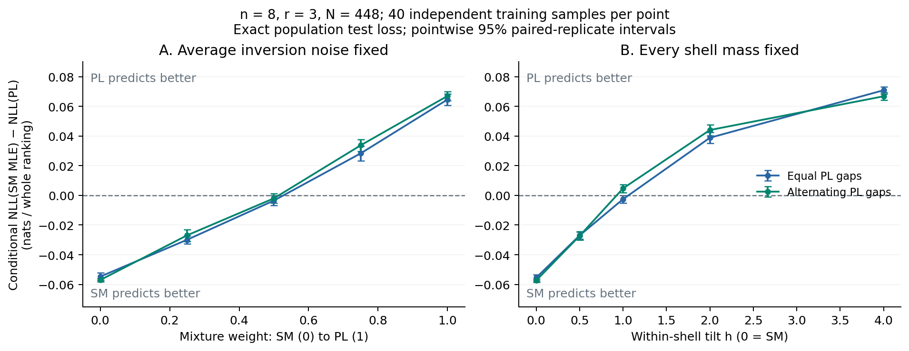
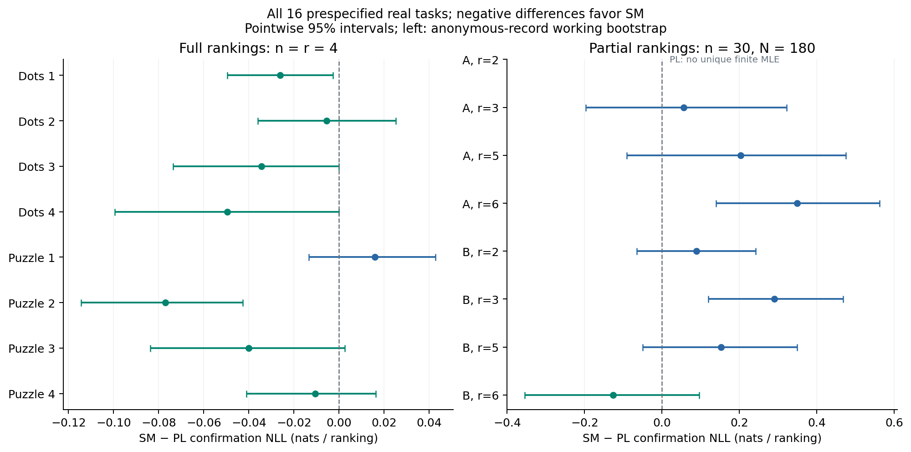
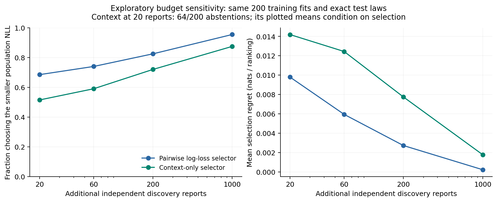

# Which data structures favor selective Mallows or Plackett–Luce?

**Strict estimator study, 25 September 2026.** Completed: **4,760 independent synthetic training samples**, **16 new real tasks / 8,763 original reports**, and a follow-up reusing 200 of those training samples. Nine additional agricultural sources were screened; all decisions are retained.

**Main finding:** the predictive winner reverses when the distribution of *which mistakes occur* changes, even with the entire inversion-count distribution fixed. Real full-ranking tasks provide tentative SM-favorable examples, while some directly elicited partial-ranking tasks favor PL. We have **not** established the specific SM context effect in real data, or a reliable small-data rule for selecting the model.

All scores are whole-ranking **conditional** negative log likelihood, in nats:

\[
\Delta=\operatorname{NLL}_{SM}-\operatorname{NLL}_{PL}.
\]

Negative values favor SM. Joint likelihood is excluded. Raw NLLs at different report lengths are not compared.

## 1. Controlled experiments: an actual reversal

Uniform displayed subsets are sampled independently; each whole ranking is generated **directly conditional on its subset**. Every model receives the same training reports. Reference orders are randomized independently of estimator tie rules. SM uses beta=0.8. The PL scale is calibrated to match expected inversion noise. Two fixed adjacent log-worth gap patterns are used: equal and alternating (1,4,1,4,...).

| Experiment | Changed | Held fixed |
|---|---|---|
| Matched-noise bridge | \(P_a=(1-a)P_{SM}+aP_{PL}\), five mixture weights | n, r, N, uniform display design, expected inversion count averaged over displays |
| Within-shell intervention | Allocation among orders at the same Kendall distance, proportional to \(P_{PL}(Y\mid S)^h\) | All of the above **and every shell's probability for every displayed set** |

The bridge changes pair heterogeneity and context dependence together; it does not isolate either one. The second experiment changes allocation within shells, although pair marginals also respond. Intermediate laws are declared synthetic alternatives, not assumed to be SM or PL. No real observations are transformed this way.

Small-catalog grids use n=8, r=2 or 3, N=8/28/112/448 for the bridge; the shell grid uses r=3 and N=28/112/448. The coverage grid uses n=32, r=3, N=40/160/640. Every cell has 40 independent repetitions. Small-n test loss is calculated over the **exact population distribution**; n=32 uses 2,000 independent test reports. Separate discovery reports are never used for fitting. [Frozen design](protocols/STRICT_FEATURE_PROTOCOL.md).

For n=8, r=3, N=448 and equal PL gaps:

| Within-shell tilt h | SM − PL NLL [95% interval] |
|---:|---:|
| 0: uniform within shells, SM | −0.0555 [−0.0577, −0.0533] |
| 0.5 | −0.0270 [−0.0295, −0.0245] |
| 1 | −0.0026 [−0.0052, 0.0000] |
| 2 | 0.0388 [0.0350, 0.0426] |
| 4 | 0.0708 [0.0685, 0.0732] |

Expected inversions remain **0.826685**, as does their complete distribution for every display. Yet the predictive winner reverses. Thus “how noisy is the dataset?” is insufficient: **whether equally distant wrong orders have unequal probabilities matters**. The alternating-gap design reproduces the reversal. These crossing locations are not universal thresholds.

The bridge moves from −0.0548 [−0.0573, −0.0522] at pure SM to +0.0647 [0.0609, 0.0685] at pure PL. Its within-pair displayed-gap slope falls from 0.10339 to zero while equal-gap reliability heterogeneity increases. This supports a joint structural explanation, not a claim that context alone caused the NLL difference.

## 2. Exact estimator contract

| Fit | Published specification | Actual implementation/domain |
|---|---|---|
| SM center MLE | Supplied manuscript, Proposition 4.1 | Exact subset DP for n<=18 |
| Larger SM center MLE | Conitzer, Davenport & Kalagnanam (2006), integral LP3 [1] | All eight n=30 real optima certified; HiGHS replaces the paper's CPLEX solver |
| SM dispersion | Manuscript Proposition 4.2 on \([0,\infty]\) | Interior root, beta=0, or beta=infinity; no cap |
| Sharp center | Algorithm 2.1 and Lemma 2.11 | Proof constants, one orientation-independent pair/report/block, fixed lexicographic packing; exact blocks up to 8 |
| Efficient center | Algorithm 3.1 | Only its lambda<=1 schedule domain; **every executed fit had depth zero** |
| Clipped Borda | Manuscript equation (3.4) | Separately named outside Algorithm 3.1's domain |
| PL MLE | Hunter (2004), §5, equation (30) [2] | Simultaneous unaccelerated MM for the full ranking likelihood |

The integer formulation is algebraically identical after eliminating antisymmetric variables; only a matching lower/upper integer bound is accepted. An uncertified incumbent would be unavailable. Changing the exact solver does not change the statistical optimization problem.

Hunter's update divides each item's count of appearances above last by the sum of inverse remaining-set worths over nontrivial choice stages containing it. All worths update simultaneously. Sum-to-one normalization changes only the unidentified scale. The fixed-point tolerance is 1e-10 and normalized gradient tolerance 1e-8; nonexistence and nonconvergence remain outcomes.

There are **no penalties, pseudo-comparisons, beta shrinkage, probability floors, inserted comparisons, outcome-dependent item deletions, or heuristic MLE replacements**. Numerical tolerances and certified exact optimization are disclosed. Larger sharp sieves are unavailable, not replaced by MLE. Real beta0=0.1 was fixed for schedule construction; its truth is not certified. The manuscript's §4 permits prespecified regularization, so earlier regularized experiments are not inherently invalid, but they answer a different question and remain separate.

For pure SM at n=8, r=3, N=448, mean Kendall errors are MLE **0.075**, sharp **0.575**, clipped Borda **0.600**, and PL-worth ordering **0.425**. Here lambda=48, outside the sparse-pair theorem regime. This is a finite-sample result, **not evidence that MLE attains the minimax lower bound**. Under hybrid laws, the stored risk is distance to a generating reference, not a proven SM population center. No active multilevel advantage of §3 was measured.

## 3. Coverage and estimator existence

Use training-sample \(\lambda=Nr(r-1)/(n(n-1))\) and \(\mu=Nr/n\).

| n=32, r=3 | lambda | mu | Result |
|---|---:|---:|---|
| N=40 | 0.242 | 3.75 | **0/40 PL fits have a unique finite MLE** at each of three mixture weights; no finite-MLE winner declared |
| N=160 | 0.968 | 15 | Pure SM: Algorithm 3.1 = Borda, Δ=−0.0280 [−0.0379, −0.0181]; all 40 PL fits exist |
| N=640 | 3.871 | 60 | Pure SM: Borda Δ=−0.0135 [−0.0174, −0.0096]; pure PL: +0.0824 [0.0780, 0.0867]; Algorithm 3.1 unavailable |

All intermediate cases and failures are saved. Low lambda alone does not establish sufficient mu or a theorem guarantee. A real dataset's numerical lambda<1 does not establish uniform subset sampling.

Unbounded SM has a boundary issue: **223/3,200 bridge MLE runs** have infinite population NLL after zero training distance yields beta=infinity. These outcomes are not repaired. Under a full-support generating law, such boundary events have positive probability at any finite N. Thus finite-fit NLL averages and intervals **do not establish finite unconditional expected plug-in log loss**. Status counts and finite-fit conditioning are explicit in the CSVs. Center risk is a separate criterion.

## 4. New real data and what they explain

The fixed split is 60% fit / 20% discovery / 20% confirmation. All usable source reports are retained; models share the same folds. Sources and decoding code are pinned and hashed.

**PrefLib Dots and Puzzle [3,4]:** all eight original tasks, n=r=4, 793–800 reports each. Dot counts or puzzle difficulty supply an objective reference order, not necessarily the population SM center. Upstream aggregation removes assessor/trial IDs, so the intervals are **anonymous-record working intervals**, not independent-assessor evidence. These full rankings can test shell structure but not changing display contexts.

**Yoo et al. (2024) [5]:** 600 participants in two arms, directly ranking 2, 3, 5 and 6 dot images. Each arm/size task has 30 images and 300 reports, split 180/60/60. Different sizes have different physical catalogs and remain separate. Whole participant blocks, reconstructed from the original export loop, use the same fold across sizes. We decode the original ordinal response, not numerical ratings. The public exports may already contain upstream screening; we add none. These eight tasks are not eight independent studies. [Encoding details](protocols/STRICT_SOURCE_ADDENDUM.md).

| Task | Confirmation Δ [pointwise 95% CI] |
|---|---:|
| Dots 1 | −0.0262 [−0.0495, −0.0028] |
| Dots 2 | −0.0054 [−0.0360, 0.0251] |
| Dots 3 | −0.0345 [−0.0735, −0.0002] |
| Dots 4 | −0.0495 [−0.0994, −0.0001] |
| Puzzle 1 | 0.0159 [−0.0135, 0.0428] |
| **Puzzle 2** | **−0.0770 [−0.1145, −0.0426]** |
| Puzzle 3 | −0.0401 [−0.0838, 0.0025] |
| Puzzle 4 | −0.0105 [−0.0412, 0.0163] |
| Dots 2024 A, r=2 | PL: no unique finite MLE |
| A, r=3 | 0.0559 [−0.1968, 0.3221] |
| A, r=5 | 0.2034 [−0.0905, 0.4751] |
| **A, r=6** | **0.3496 [0.1402, 0.5619]** |
| B, r=2 | 0.0887 [−0.0649, 0.2426] |
| **B, r=3** | **0.2900 [0.1197, 0.4686]** |
| B, r=5 | 0.1532 [−0.0503, 0.3489] |
| B, r=6 | −0.1261 [−0.3545, 0.0957] |

Intervals are unadjusted and conditional on the fits. Source search and dependent tasks preclude treating this as a population prevalence study of model suitability.

**An SM-favorable example:** Puzzle 2 has NLL 2.6746 versus PL's 2.7516. The exact shell decomposition attributes −0.0403 to shell masses and **−0.0367 [−0.0668, −0.0059]** to within-shell allocation. Replacing PL's unequal within-shell probabilities with uniform allocation improves confirmation prediction here. This supports the proposed explanation; it does not prove exact uniformity or a true SM generating model.

**PL-favorable examples:** in 2024 A/r=6, the within-shell component is **+0.2139 [0.0350, 0.3811]**; in B/r=3 it is **+0.0920 [0.0136, 0.1703]**. PL's differentiated probabilities among equally distant rankings contribute to its advantage. This is a predictive, not causal, decomposition. B/r=6 remains unresolved and is retained.

**The specific context effect remains unconfirmed.** Pairs rarely recur at different displayed-center gaps. In 2024 B/r=6, the fitted-center slope is 0.0414 [−0.0776, 0.1690], against SM's 0.0658 and PL's zero. Both remain compatible. The objective-reference slope is −0.0533 [−0.1752, 0.0577], illustrating the importance of center uncertainty. No new task convincingly confirms the positive SM effect. Arbitrary third-item dependence alone would not validate the SM gap formula.

### Further source search: no data repair

The frozen agricultural follow-up included **all nine** entries with at least 500 listed participants in the pinned AgrDataSci/tricot-data catalog [6]. Five have no overall-ranking trait. Four contain non-strict reports:

| Overall-evaluation source | Reported assessments | Complete strict triples | Non-strict reports |
|---|---:|---:|---:|
| Tanzania groundnut c3c46a31b5cb | 265 | 240 | 25 |
| Tanzania groundnut f9d88801f7fa | 406 | 306 | 100 |
| Tanzania groundnut 7525d0c24f31 | 573 | 350 | 223 |
| Nigeria cowpea 46c9305acadb | 385 | 192 | 193 |

For example, (1,2,2) does not order all three items strictly. The frozen rule excludes the **whole task** instead of deleting such reports or breaking ties. Therefore there are **zero agricultural fits**, not nine negative model comparisons. The [complete audit](../results/strict_features/tricot_eligibility.csv) includes missing assessment counts. This does not prove no suitable agricultural dataset exists. The smaller Rwanda wheat source and inaccessible 2019 replication data are recorded in the [follow-up protocol](protocols/STRICT_FEATURE_FOLLOWUP.md).

## 5. Can diagnostics choose a model before testing?

The pairwise selector compares marginal pair log loss on independent discovery reports, averaging within reports. The context selector compares the observed within-pair slope with SM's prediction and zero. Neither changes an estimator. For r=2 the first is ordinary validation likelihood, not an independent structural test.

The exploratory budget follow-up reuses **the same 200 original training fits** and exact test distributions:

| Discovery reports | Pairwise selector correct | Mean regret (nats/ranking) | Context selector correct |
|---:|---:|---:|---:|
| 20 | 68.5% | 0.00979 | 51.5% of 136 selections; 64 abstentions |
| 60 | 74.0% | 0.00594 | 59.0% |
| 200 | 82.5% | 0.00272 | 72.0% |
| 1,000 | 95.5% | 0.00022 | 87.5% |

These are descriptive averages over five specified mixture weights with n=8,r=3,N=448, not accuracy estimates for arbitrary future datasets. Regret is the selected-model population NLL minus the better fitted model's population NLL. Per-cell intervals and paired budget contrasts are saved. The 1,000-report choices reproduce the original run.

The pairwise selector agrees with the *confirmation point-estimate* winner in **10/15** comparable real tasks, with one further task unavailable. Several differences are unresolved and tasks are dependent. This cannot establish reliable real-data selection. The context-only diagnostic is particularly unreliable at current sample sizes.

## 6. What we can conclude

1. **Controlled support:** within-shell error allocation changes the predictive winner independently of the inversion-count distribution.
2. **Tentative real examples:** uniform within-shell allocation helps in Puzzle 2; unequal allocation helps in two partial-dots tasks. This is not a universal classification rule.
3. **Still unsupported:** a verified real SM context effect, reliable small-data model selection, minimax optimality of MLE, or an active §3 hierarchy advantage.

A useful next independent study would repeat the same pairs in randomized triples, placing the third item **between** versus **outside** them in an externally anchored order, with balanced assessor groups. It should collect enough repetitions per pair/context and retain strict original reports. This follows from the coverage and diagnostic-budget findings; it does not justify retrospective modifications to existing observations.

## References and reproducibility

The supplied private manuscript is the authority for Algorithms 2.1/3.1/3.2, equation (3.4), Lemma 2.11, and Propositions 4.1–4.3. It is not redistributed.

1. Conitzer, V., Davenport, A., & Kalagnanam, J. (2006). **Improved Bounds for Computing Kemeny Rankings.** AAAI. [Publisher PDF](https://cdn.aaai.org/AAAI/2006/AAAI06-099.pdf). Integral LP3; this code uses HiGHS with certificates instead of the paper's CPLEX.
2. Hunter, D. R. (2004). **MM algorithms for generalized Bradley–Terry models.** *Annals of Statistics*, 32(1), 384–406. [Publisher PDF / DOI](https://projecteuclid.org/journals/annals-of-statistics/volume-32/issue-1/MM-algorithms-for-generalized-Bradley-Terry-models/10.1214/aos/1079120141.pdf), §5, equation (30).
3. Mao, A., Procaccia, A. D., & Chen, Y. (2013). **Better Human Computation Through Principled Voting.** AAAI. [Official proceedings PDF](https://ojs.aaai.org/index.php/AAAI/article/download/8460/8319).
4. PrefLib official [Dots](https://preflib.github.io/PrefLib-Jekyll/dataset/00024) and [Puzzle](https://preflib.github.io/PrefLib-Jekyll/dataset/00025) collections; [PrefLib/PrefLib-Data](https://github.com/PrefLib/PrefLib-Data) commit **1a8e9a9d0ad02a2a2d7473e813d1ac3057264f80**. [File-level sources and hashes](../data/strict_feature_sources.json).
5. Yoo, Y., Escobedo, A. R., Kemmer, R., & Chiou, E. (2024). **Elicitation and aggregation of multimodal estimates improve wisdom of crowd effects on ordering tasks.** *Scientific Reports*, 14, 2640. [Paper](https://www.nature.com/articles/s41598-024-52176-3); [official source and export code](https://github.com/ryankemmer/simpleRatingRanking). Arm A commit **8bc1331abea2fdbfb4ce75cd453565bda83f4dc7**, arm B **e133bec2eb766cef2f0741d4e7d175f89a4719f4**.
6. **AgrDataSci/tricot-data**, [official repository](https://github.com/AgrDataSci/tricot-data), [Zenodo DOI](https://doi.org/10.5281/zenodo.17112492), commit **169edfaba947b5afee52c1e217e0ff275fb71e34**, CC BY-SA 4.0. [Source manifest](../data/strict_tricot_sources.json).

[Reproduction commands and formal uncertainty definitions](../results/strict_features/README.md). [Validation](../results/strict_features/validation.json). Main, source and follow-up protocols were committed respectively as **4dfcd26c9bc386d9048f1f76c3cee391cad96cc2**, **771171b242d54c7f8b8e815e5a7e552c7fbc3b33**, and **fa958a4ab42e5d3fbaff3904526526f5c9216633** before their corresponding computations.

**Recovery provenance:** after calculations and local validation finished, the workspace disconnected during publication. Source code was restored from the session and the same pinned inputs, seeds, estimators and designs were rerun successfully in GitHub Actions. All 15 comparable real-task deltas, primary simulation summaries and diagnostic-budget accuracies match the recorded pre-disconnect values. This replay is not counted as additional independent evidence. [Recovery status](../results/strict_features/recovery_status.json). Earlier regularized results remain separate historical experiments.
