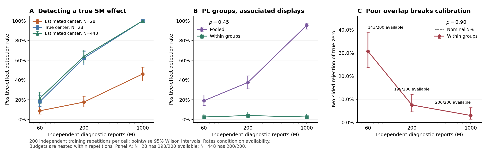

# Additional data and mechanism validation

26 September 2026. Three new empirical tasks and **1,400 independent synthetic training datasets** are complete. The original estimators and diagnostic definitions are unchanged. The primary real comparison has **no clear winner on any of the three new tasks**. Simulations identify two important limitations: an inaccurate center can hide a true SM context effect, and heterogeneous PL groups can produce both a positive marginal context effect and a predictive advantage for a single SM fit.

This follow-up was motivated by earlier findings. Its [design](protocols/VALIDATION_EXTENSION_20260926.md) and [source amendment](protocols/VALIDATION_SOURCE_AMENDMENT.md) were committed before its fits as `ddad79788574374d3c31699c74a145ff75d9008f` and `6e3cef2e97978153f5c4c6911f5a62b94d905bd0`. It is a frozen follow-up, not an independently preregistered original study.

## 1. Additional original data

| Task | Original observations | Why useful | Training coverage |
|---|---|---|---|
| Sounds [1,2] | 1,380 direct pair comparisons; 46 assessors; 12 sounds | Tests common upset probability against varying pair strength; retains assessor IDs | N=810, lambda=12.27, mu=135 |
| PatrasIQ cost of living [3,4] | 392 six-city rankings; 36 cities | Whole-ranking prediction, shell allocation, changing displayed gaps | N=235, lambda=5.60, mu=39.17 |
| PatrasIQ population [3,4] | 392 six-country rankings; 48 countries | Same diagnostics, with a second objective task | N=235, lambda=3.13, mu=29.38 |

Sounds asks about perceived human agency in sounds. All released responses remain, including cycles across different pair reports for 37 assessors. Those cycles are valid observations, not malformed individual rankings. The original `prefs4BM` object matches the packaged data. We split whole assessors: 27 training, 9 discovery, 10 confirmation. Confirmation contains 300 pair reports. There is no known population center.

Each PatrasIQ volunteer supplied one assigned six-item ranking per task. Each task has 80 distinct bundles, repeated 4–6 times. Lossless expansion retains every report; the fixed split is 235/78/79. The source labels encode external cost/population answers, **not a known latent SM center**. The same volunteers contributed to both tasks, but cross-task identities cannot be recovered; results are separate, not independent replications. A per-task report bootstrap is justified by the documented one-report-per-person design. It does not infer missing identities or permit pooling the tasks.

These data add examples outside the Section 3 schedule: all training lambda values exceed 1, and the display design is not certified as independent uniform sampling from every possible subset. Numeric lambda/mu alone do not establish a theorem's assumptions. The earlier sparse-coverage experiments remain separate.

**Source exclusion before fitting:** the beach example in Vitelli et al. [5] dropped nontransitive patterns from nine assessors. We could not verify an unfiltered original response table in the release, so no beach fit is reported. Missing answers also occurred in the original collection; we do not attribute every missing comparison to filtering. Potato and breakfast examples were screened but not prioritized for the changed-display question; their fixed displays do not make them intrinsically invalid for other SM questions. A context-choice paper was background screening only; we did not turn choices into full rankings. The [complete scoped screen](../results/validation_extension/source_screen.csv) records these decisions.

## 2. Real predictive results

Delta is confirmation mean conditional whole-ranking NLL(SM) minus NLL(PL), in nats/report. Negative favors SM. Each interval uses 2,000 paired whole-unit bootstrap draws, **conditional on the frozen training fits**. Sounds resamples assessors; PatrasIQ resamples individual volunteers' reports. Intervals do not cover training uncertainty, volunteer selection or source-search uncertainty.

| Task | PL NLL | Exact SM MLE NLL | Delta | Pointwise 95% interval |
|---|---:|---:|---:|---|
| Sounds | 0.6620 | 0.6812 | +0.0192 | [−0.0088, +0.0433] |
| Cost of living | 4.9438 | 5.0255 | +0.0817 | [−0.1293, +0.3061] |
| Population | 5.7102 | 5.7743 | +0.0641 | [−0.1746, +0.3101] |

All three exact center objectives are certified (323, 687 and 796 total training disagreements). Sounds uses manuscript subset DP; the larger tasks use Conitzer's integer LP3 formulation with HiGHS. These are exact objective solutions, potentially with tied centers. PL uses Hunter's unpenalized simultaneous MM. See the [method contract](algorithms.md) for algorithm attribution and numerical certification.

All literal sharp fits are unavailable because their required exact sieve exceeds the recorded computational scope. All efficient fits are outside the lambda schedule. No replacement is made. Separately named clipped Borda is retained: its cost-task delta is +0.3205 [0.0595, 0.5492], while the exact-MLE comparison above is unresolved. This does not justify declaring that PL defeats the entire SM family, nor does a significant comparison beside an insignificant one establish a significant difference between the estimators.

The structural diagnostics provide clues, not a selection rule:

- **Sounds:** in three training-defined signed PL log-worth-gap bins, confirmation agreement with the SM center is 47.5%, 54.5%, 72.0%. SM predicts 60.1% in every bin; PL predicts 49.2%, 56.9%, 66.2%. This suggests heterogeneous pair reliability. The lowest bin also includes disagreement between the fitted centers. Discovery does not reproduce a clear increasing gradient, and only ten confirmation assessors are available. The overall predictive comparison remains unresolved.
- **PatrasIQ:** neither task confirms a positive SM context effect. About the fitted center, estimated slopes are −0.031 (cost) and −0.106 (population); about the objective answer order, they are +0.006 and −0.038. Some plug-in intervals exclude zero or the fitted SM prediction, but the calibration failures below prevent treating these as definitive model-family rejections. All reference orders and splits are reported.
- **Shells:** confirmation within-shell contributions to delta are +0.068 (cost) and −0.035 (population); both intervals include zero. Discovery advantages for PL did not yield a clear confirmation winner. We retain both splits.

## 3. Synthetic A: a real SM effect can be missed

We directly sample whole rankings with n=8, r=3 from SM(beta=0.8) or a PL law matched in expected inversions. Displays are independently uniform. N=28 or 448 corresponds to (lambda,mu)=(3,10.5) or (48,168). There are 200 independent training datasets per cell, with randomized item labels. These are finite-sample diagnostic checks outside the lambda<=1 regime, not new risk-bound experiments.

For each fitted pair of models, independent diagnostic samples use nested budgets M=60,200,1000. The unchanged within-pair slope measures how center-oriented agreement changes with displayed center gap. A positive detection means its percentile 95% interval lies entirely above zero. An oracle reference uses the true center; it is a diagnostic control, not a new estimator.

**Detection frequency when SM really generates the data:**

| Reference and training size | M=60 | M=200 | M=1000 | Available repetitions |
|---|---:|---:|---:|---:|
| Fitted center, N=28 | 8.8% | 17.6% | 46.1% | 193/200 |
| True center, N=28 | 18.1% | 62.2% | 100% | 193/200 |
| Fitted center, N=448 | 21.5% | 64.0% | 100% | 200/200 |

The SM MLE's mean Kendall error decreases from 4.44 to 0.02. With N=28 and M=1000, the fitted-reference observed slope averages 0.039, versus 0.103 with the true reference. Center error therefore attenuates this diagnostic in these cells. Increasing diagnostic data alone does not remove it. Rejection of the *fitted SM prediction* reaches 84.5% in that cell even though the generating family is SM; that residual also depends on dispersion estimation, not just the center.

Availability is part of the result: at N=28 the PL MLE is nonfinite/nonunique in 7 SM-generated and 14 PL-generated repetitions. The frozen procedure leaves their comparisons and diagnostics unavailable, including the oracle diagnostic, which still requests a PL fit. The table is conditional on availability; there is no unconditional small-N mean delta. No pseudo-comparisons or regularization are added.

At N=448, mean exact population delta is −0.05715 [−0.05800, −0.05629] under SM and +0.06206 [0.06033, 0.06379] under PL. These Monte Carlo t intervals use 200 independent training repetitions, not bootstrap reports. Population loss is summed over the exact finite support, not estimated from the diagnostic data.

The original context selector is correct about the **better fitted population predictor**, not necessarily the generating family. For SM/N=28 its accuracy is only 59.1%, 65.8%, 68.9% across the budgets. For N=448 it improves from 75.5% to 100% under SM and from 71.5% to 100% under PL. These endpoints do not establish a universal selector. Even under homogeneous PL, nominal two-sided 5% zero-effect rejection varies from 2.0% to 9.5% across the specified cells; uniform exact calibration is not established.

## 4. Synthetic B: heterogeneous PL can resemble SM

Each of two groups follows genuine PL with the same item order but different worth spacing. The displays are {A,B,C} and {A,C,D}. Within either group, P(A precedes C) is identical in both displays. We vary rho, which associates the stronger-signal group with {A,B,C}; marginal group and display shares stay one half. This stress test does not claim to keep average inversion noise fixed.

The exact *marginal* focal contrast is rho times [logistic(1.6) − logistic(0.4)]. Each cell has N=448 and 200 independent repetitions. Its catalog averages are lambda=224 and mu=336, but only two displays are sampled, so uniform-design theory does not apply.

| Assignment association rho | Exact marginal contrast | Mean population delta | 95% Monte Carlo interval |
|---:|---:|---:|---|
| 0 | 0 | +0.00744 | [0.00715, 0.00773] |
| 0.45 | +0.1050 | −0.00524 | [−0.00577, −0.00471] |
| 0.90 | +0.2100 | −0.00842 | [−0.00925, −0.00758] |

**A positive pooled context effect and an SM predictive win can coexist when every group actually follows PL.** Neither global single-population fit is the true heterogeneous law. The pooled association is real; inferring an individual SM mechanism from it would be the mistake.

At rho=0.45 and M=1000, the pooled positive effect is detected in 95.5% of repetitions, versus 2.5% after pair-by-group adjustment. The adjusted mean slope is approximately zero. Group adjustment here is an explanatory diagnostic with known group labels; it does not replace either fitted preference estimator.

There is also a failure that must be retained: at rho=0.90 and M=60, the adjusted diagnostic is available in only 143/200 repetitions. Among those, its nominal two-sided 5% test rejects the true zero effect **30.8%** of the time. At M=200 availability is 199/200 and rejection 7.5%; at M=1000 all 200 are available and rejection is 3.0%. Sparse overlap undermines the current percentile bootstrap. We did not retune eligibility, add pseudo-observations or replace its intervals after seeing this failure. Earlier sparse real context intervals must therefore remain exploratory; this result does not assess the separate whole-ranking NLL bootstrap.

Error bars are pointwise Wilson intervals across independent repetitions. Budgets within a repetition are nested and dependent. The third panel is conditional on diagnostic availability.

## 5. What this adds, and what remains open

Synthetic data are useful here because the center, mechanism and confounding are known. They validate specific implications and expose diagnostic failures; they do not establish that the same mechanism explains a real dataset. The new real tasks broaden the evidence but do not confirm a positive SM context mechanism or a decisive new model winner.

The next informative empirical study needs repeated identical pairs in different displays, enough accurate training information for the reference order, recorded assessor/group identities, and overlapping display assignment within groups. Randomizing a third item between versus outside a focal pair would separate the target effect from group composition. Merely adding more unrelated rankings or more test reports with an inaccurate center does not resolve those problems.

No estimator module changed. All 2,164 eligible original reports, every unavailable fit, all synthetic draws and fitted parameters are accounted for. Empirical per-report predictions and unit/split records remain local; GitHub contains aggregate empirical outputs, fitted parameters and generated synthetic records. These 1,400 new datasets are distinct from the earlier 4,760; bootstrap draws, nested budgets and reproducibility replays are not extra independent experiments. [Saved results and field definitions](../results/validation_extension/README.md), [validation evidence](../results/validation_extension/validation.json), [reproduction](reproducibility.md).

During publication checks, the parameter log was found to lack its final ten records, while all fit and diagnostic outcome tables were complete. Replay from the unchanged frozen seeds recovered those records: all 20 corresponding fit rows and 60 diagnostic rows matched within 1e-12. No summary or prediction result changed. The completed draw archive and exact repetition-count checks now pass. [Recovery record](../results/validation_extension/parameter_log_recovery.json). Earlier validation's missing completeness assertion is explicitly corrected; this replay adds no independent experiments.

## Sources

1. **Crispino, M., Arjas, E., Vitelli, V., Barrett, N., & Frigessi, A. (2019).** A Bayesian Mallows approach to nontransitive pair comparison data: How human are sounds? *Annals of Applied Statistics*, 13(1), 492–519. [DOI](https://doi.org/10.1214/18-AOAS1203). Empirical Sounds source; its Bayesian estimator is not a comparison arm here.
2. **Barrett, N., & Crispino, M. (2018).** The impact of 3-D sound spatialisation on listeners' understanding of human agency in acousmatic music. *Journal of New Music Research*, 47(5), 399–415. [DOI](https://doi.org/10.1080/09298215.2018.1437187). Source credited by the [pinned Sounds documentation](https://github.com/ocbe-uio/BayesMallows/blob/a26cf89d3142ea3499489730e7c2b3ef9a26bfb2/man/sounds.Rd).
3. **Caragiannis, I., Chatzigeorgiou, X., Krimpas, G. A., & Voudouris, A. A. (2017).** Optimizing Positional Scoring Rules for Rank Aggregation. *AAAI*, 430–436. [Official paper](https://ojs.aaai.org/index.php/AAAI/article/view/10585). Originating PatrasIQ study.
4. **PrefLib.** [Cities/Countries, dataset 00034](https://preflib.github.io/PrefLib-Jekyll/dataset/00034). Design, one report per volunteer per task, objective reference, and original files. Commit `1a8e9a9d0ad02a2a2d7473e813d1ac3057264f80`.
5. **Vitelli, V., Sorensen, O., Crispino, M., Frigessi, A., & Arjas, E. (2018).** Probabilistic preference learning with the Mallows rank model. *JMLR*, 18(158), 1–49. [Paper](https://jmlr.org/papers/v18/15-481.html), Section 6.2. Documents the beach filtering; this is not the supplied private manuscript.
6. **BayesMallows maintainers.** [Pinned data, decoding scripts and documentation](https://github.com/ocbe-uio/BayesMallows/tree/a26cf89d3142ea3499489730e7c2b3ef9a26bfb2). Data source only, not the fitted model implementation. All acquired files have hashes in the [source manifest](../data/validation_extension_sources.json).
7. **Seshadri, A., Peysakhovich, A., & Ugander, J. (2019).** Discovering Context Effects from Raw Choice Data. *ICML*, PMLR 97, 5660–5669. [Paper](https://proceedings.mlr.press/v97/seshadri19a.html). Screening/background only; no additional complete-ranking release verified for this extension.
8. **Green, P. E., & Rao, V. R. (1972).** Applied Multidimensional Scaling: A Comparison of Approaches and Algorithms. Holt, Rinehart and Winston. Breakfast metadata screened through [PrefLib 00035](https://preflib.github.io/PrefLib-Jekyll/dataset/00035), digitized by Dominik Peters. No breakfast model fits in this study.

The private manuscript defines the SM estimators. Hunter (2004) and Conitzer et al. (2006) define the unchanged PL algorithm and exact-center formulation. Their full references and the solver distinction are in the [canonical reference list](references.md).
